# Техническое задание на создание национальной цифровой платформы «Метро Душанбе» (редакция 2.0)

> **Статус документа:** расширенная редакция ТЗ, пригодная для государственного закупочного досье.
> **Основа:** переработка и дополнение `docs/metrodushanbe.md` (ред. 1.0).
> **Структура:** гибрид действующей структуры ред. 1.0 и обязательного каркаса **ГОСТ 34.602‑2020** «Техническое задание на создание автоматизированной системы».
> **Размещение системы:** on‑prem / государственный ЦОД Республики Таджикистан, архитектура cloud‑ready.
> **Дата составления:** 4 июля 2026 г. Все фактические сведения о проекте метро приведены «по открытым данным на дату составления» и подлежат уточнению у заказчика.
> **Языки платформы:** таджикский (tg), русский (ru), английский (en).

---

## Раздел 0. Ревью исходного ТЗ (ред. 1.0) и changelog

Настоящий раздел фиксирует результат экспертной ревизии исходного документа и перечень внесённых изменений. Он предназначен для заказчика и приёмочной комиссии и не является частью требований к системе.

### 0.1. Общая оценка

Исходное ТЗ (ред. 1.0) — сильный черновик: логичная структура, ссылки на открытые стандарты (OpenAPI, OAuth2/JWT, GTFS, GeoJSON, WCAG, PostGIS), ER‑диаграммы, примеры DDL, фазировка, реестр рисков. Однако документ был подготовлен инструментом автоматического «глубокого исследования», что породило ряд артефактов и системных пробелов, критичных для документа уровня госзакупки и для реального проектирования платформы метро. Ниже — разбор по четырём категориям.

### 0.2. Лишнее / избыточное (удалено или переработано)

| # | Что | Решение в ред. 2.0 |
|---|---|---|
| L‑1 | Нерабочие токены‑цитаты вида `cite​turnXsearchY` по всему тексту (артефакты AI deep‑research) | Полностью удалены. Все ссылки собраны в нумерованный **Раздел 15.9 «Источники и нормативные ссылки»** |
| L‑2 | Байт‑в‑байт дубликат документа в `photo/deep-research-report (1).md` | Признан техническим мусором. Рекомендуется удалить из репозитория (не удаляется в рамках данной работы без отдельного согласования) |
| L‑3 | Плоское НФТ «100 000 concurrent sessions» независимо от фазы | Заменено **фазовой моделью нагрузки** (информационный портал → эксплуатация), см. 6.1.6 |
| L‑4 | Мок дашборда с «зашитыми» числами (132 станции и т. п.) в теле документа | Помечен как иллюстрация, перенесён логически в контекст UX (8.4) |
| L‑5 | Сущности `ROUTE_SEARCH` / `ROUTE_RESULT` как реляционные с внешними ключами | Переведены в **аналитический/событийный контур** (не ядро OLTP‑модели), см. 6.2 и 6.3.1 |

### 0.3. Неправильное / противоречивое (исправлено)

| # | Что | Решение в ред. 2.0 |
|---|---|---|
| E‑1 | Палитра дизайн‑системы (`#0057B8 / #00A3A3 …`) **не совпадает** с реальным брендовым логотипом `photo/dushanbe_metro_logo.svg` (Navy `#082742`, Red `#E21B2D`, Green `#138A3D`) | Дизайн‑система приведена к цветам логотипа + семантические производные с проверкой контраста WCAG, см. 8.5 |
| E‑2 | Противоречие в auth‑архитектуре: одновременно «resource server + внешний IdP» и «собственный IdP вне объёма» | Уточнено: собственный сервер авторизации (**Keycloak**) для граждан/операторов; внешний государственный IdP — как будущая федерация, см. 6.3.3 и 9.2 |
| E‑3 | Смешение метрик восстановления (RTO/RPO) с латентностью доставки уведомлений | Метрики разнесены: RTO/RPO — в 6.1.7; латентность доставки — в KPI/SLA уведомлений, см. 3.3 и 6.2 |
| E‑4 | «Версия для слабовидящих как отдельный UX‑профиль» — устаревший паттерн | Заменено на **единый доступный интерфейс** WCAG 2.2 AA с режимами (контраст/крупный шрифт/уменьшенная анимация), см. 8.7 |
| E‑5 | GTFS Fares v2 как жёсткий внешний формат «с этапа проектирования» | Смягчено до «целевой формат, где применимо» (спецификация развивается, потребителей мало), см. 6.2 и 15.8 |
| E‑6 | Несогласованность дат/таймлайна (2024 vs 2025 пред‑ТЭО; «в июле 2026» vs «1 июля 2026») | Таймлайн унифицирован и помечен «по открытым данным на дату составления», см. 4.2 |

### 0.4. Пропущено (добавлено в ред. 2.0)

| # | Пробел | Где закрыт |
|---|---|---|
| M‑1 | Домен **AFC / сбора оплаты** (турникеты, валидаторы, tap‑in/out, стоп‑лист) | 6.2.11 |
| M‑2 | **Платёжная сага + PCI DSS** (authorize/capture/refund, reconciliation, минимизация периметра) | 6.2.13, 9.4 |
| M‑3 | **Кабинет пассажира** (профиль, кошелёк билетов, история, согласия) | 6.2.14 |
| M‑4 | **Обращения граждан + бюро находок** | 6.2.15 |
| M‑5 | **ЧС / эвакуация / интеграция с 112** | 6.2.16 |
| M‑6 | **Открытые данные** (публикация GTFS по стабильному URL, портал разработчика) | 6.2.17 |
| M‑7 | **Офлайн‑режим метро** (карта/расписание/билет под землёй) | 6.2.18 |
| M‑8 | **Унифицированный поиск + геокодер** | 6.2.19 |
| M‑9 | **Wayfinding / indoor‑навигация** (задел) | 6.2.20 |
| M‑10 | Неназванные архитектурные решения: движок маршрутизации, геокодер, тайл‑сервер, брокер/outbox, миграции БД, realtime‑транспорт | 6.1.3, 6.3.4 |
| M‑11 | **Хостинг и резидентность данных** | 6.1.2, 9.5 |
| M‑12 | **Приватность**: consent, DSAR, retention, обезличивание, PII‑scrubbing | 9.3 |
| M‑13 | Матрица поддержки устройств/браузеров, бюджеты производительности мобильного приложения | 6.1.6, 8.6 |
| M‑14 | Организация поддержки (L1–L3, on‑call, классификация P1–P4), политика версионирования/депрекации публичного API | 6.1.8, 7.6 |
| M‑15 | **RTM**, каталог доменных событий, каталог кодов ошибок, словарь данных, глоссарий | 5, 7.4, 7.5, 15.1–15.4 |
| M‑16 | Обязательные разделы ГОСТ: термины, стадии создания, порядок приёмки, требования к документированию | 5, 10, 11, 12 |

### 0.5. Требует доработки на следующих итерациях (вынесено в открытые вопросы)

- Точные перечни станций, окончательные геометрии линий, коммерческая тарифная сетка, интервалы движения, спецификации турникетов/валидаторов — **не определены** на дату составления; закрываются механизмами импорта/версионирования (Раздел 13).
- Конкретный банк‑эквайрер и PSP, а также перечень государственных реестров для интеграции — уточняются на этапе эскизного проекта (ЭП).
- Модель тарификации (зонная vs плоская), правила льгот — требуют нормативного решения заказчика (см. 6.2.12).

### 0.6. Сводный changelog ред. 1.0 → 2.0

1. Введён каркас ГОСТ 34.602‑2020 (термины, требования к системе в целом/функциям/обеспечению, стадии, приёмка, документирование).
2. Каждому функциональному модулю добавлен подраздел **«Бизнес‑правила»** и, где применимо, диаграмма состояний.
3. Добавлены 9 новых доменов (M‑1…M‑9) и кросс‑доменные требования (офлайн, загрузка вагонов, мультимодальность).
4. Введены сквозные **идентификаторы требований** и **матрица трассируемости (RTM)**.
5. Зафиксировано размещение on‑prem/гос. ЦОД РТ и требования резидентности ПДн.
6. Дизайн‑система приведена к брендовому логотипу; удалены нерабочие цитаты; унифицирован таймлайн.

---

## Раздел 1. Общие сведения

### 1.1. Наименование системы

Полное наименование: **Национальная цифровая платформа «Метро Душанбе»**. Условное сокращение по тексту — **Платформа** или **НЦП «Метро Душанбе»**.

### 1.2. Наименование сторон и основания для разработки

| Параметр | Значение |
|---|---|
| Заказчик | Определяется государственным контрактом (ожидаемо — профильный орган: Министерство транспорта РТ / Хукумат г. Душанбе / оператор метро). Владелец продукта и данных |
| Исполнитель | Определяется по результатам конкурсной процедуры |
| Основание разработки | Государственный контракт/техническое задание; программа развития городского и интеллектуального транспорта г. Душанбе |
| Порядок финансирования | В соответствии с условиями государственного контракта |

### 1.3. Плановые сроки

Плановые сроки начала и окончания работ определяются календарным планом государственного контракта. Проектная фазировка платформы (ориентировочно 2026–2033) приведена в Разделе 10 и является **проектным планом платформы**, а не официально утверждённым календарём строительства метро.

### 1.4. Порядок оформления и предъявления результатов

- Результаты работ предъявляются поэтапно в соответствии со стадиями создания (Раздел 10) и порядком приёмки (Раздел 11).
- Состав поставки каждого этапа включает работающее ПО, исходный код, эксплуатационную и рабочую документацию (Раздел 12).
- Приёмка производится по критериям приёмки (11.3) с оформлением актов.

---

## Раздел 2. Назначение и цели создания системы

### 2.1. Назначение

Платформа **«Метро Душанбе»** — единая цифровая система городского масштаба для публикации интерактивной карты метро, маршрутов, станций, расписаний, сервисных уведомлений, тарифов и цифровых билетов, а также для администрирования, аналитики и межведомственных интеграций. Платформа обслуживает **две последовательные «реальности»**:

1. **Режим «строящийся объект и коммуникационная платформа»** — официальный цифровой канал проекта: карта проектируемой сети, паспорт объекта, дорожная карта, новости, уведомления, сбор обратной связи, инструменты для органов города и подготовительных служб.
2. **Режим «эксплуатационная пассажирская и операционная платформа»** — промышленная система с высокой доступностью и низкой задержкой: realtime, билеты, сбор оплаты, диспетчеризация, интеграции с ITS.

Архитектура обязана поддерживать плавный переход между режимами без переделки публичных контрактов.

### 2.2. Цели создания системы

| Код | Цель | Содержание |
|---|---|---|
| G‑1 | Публичная навигация | Достоверная и удобная интерактивная карта метро и мультимодальных пересадок для жителей и гостей |
| G‑2 | Единый источник данных | Единый реестр линий, станций, объектов инфраструктуры, событий, тарифов со стабильными идентификаторами |
| G‑3 | Операционное управление | Инструменты публикации, валидации, диспетчеризации данных и событий |
| G‑4 | Межведомственное взаимодействие | Машиночитаемые API и события для органов города, ITS, банков, платёжных систем, транспортных сервисов |
| G‑5 | Масштабируемость | Архитектура, поддерживающая рост от режима «строится» до массовой ежедневной эксплуатации |
| G‑6 | Доступность и инклюзивность | Три языка (tg/ru/en) и соответствие WCAG 2.2 AA, включая пользователей с ОВЗ |
| G‑7 | Соответствие и суверенитет данных | Соблюдение законодательства РТ о персональных данных и об электронном документе; резидентность данных в РТ |

### 2.3. Критерии достижения целей (KPI)

KPI являются управленческими и техническими целевыми показателями готовности продукта (не историческими данными) и применяются **с учётом фазы** (см. 6.1.6).

| Группа | Показатель | Целевое значение | Фаза применения |
|---|---|---|---|
| Доступность | Доступность публичного web/API в месяц | ≥ 99,9% | с фазы операционной готовности |
| Производительность | P95 ответа API чтения (серверная сторона, тёплый кэш) | ≤ 300 мс | все фазы |
| Карта | First meaningful render карты на 4G | ≤ 2,5 сек | все фазы |
| Уведомления | Время публикации сервисного сообщения (оператор → клиент) | ≤ 60 сек | все фазы |
| Локализация | Покрытие критических экранов тремя языками | 100% | все фазы |
| Доступность | Соответствие WCAG 2.2 | уровень AA | все фазы |
| Данные | Доля обязательных сущностей со стабильными ID и геометрией | 100% | все фазы |
| Аналитика | SLA обновления витрин | near‑real‑time для оперативных, ≤ 15 мин для BI | с фазы операционной готовности |
| Безопасность | Критические уязвимости на момент go‑live | 0 | каждый релиз |
| Поддержка | Среднее время реакции на инцидент P1 | ≤ 15 мин | с фазы эксплуатации (при наличии 24/7 NOC, см. 6.1.8) |
| Билеты | Успешность платёжных транзакций | ≥ 99,5% успешных из технически завершённых | с фазы билетного контура |
| AFC | Латентность распространения стоп‑листа на валидаторы | ≤ 5 мин | с фазы эксплуатации |

---

## Раздел 3. Характеристика объекта автоматизации

### 3.1. Контекст проекта

Объект автоматизации — цифровой контур городского метрополитена г. Душанбе на всех стадиях его жизненного цикла: от проектирования и строительства до эксплуатации. Платформа изначально проектируется как часть будущей транспортной цифровой экосистемы города (метро + интеллектуальный транспорт + мультимодальные пересадки), а не как изолированное «приложение карты».

### 3.2. Публичные вехи проекта (по открытым данным на дату составления)

> Приведено для контекста и подлежит уточнению у заказчика. Даты и формулировки не являются нормативными.

- Март 2022 — подписан профильный меморандум с корейской стороной по теме строительства метро.
- 2024–2025 — этапы подготовки к ТЭО и малые проекты пред‑ТЭО (участок «южные ворота — район Государственного цирка»).
- 2026 — проекты поддержки рабочей группы и подготовки пред‑ТЭО второй линии («Государственный цирк — Восточные ворота»); отдельный проект по развитию интеллектуального транспорта в Душанбе.
- 1 июля 2026 — подведение итогов этапа подготовки к ТЭО направления «проспект Саади Ширази — Восточные ворота» и положительная оценка возможности строительства подземного метро.

**Вывод для платформы:** на дату составления подтверждены стадии подготовки ТЭО и проектирования, а не завершённая эксплуатационная конфигурация. Точные перечни станций, геометрии, тарифы и регламенты **не определены** и закрываются механизмами импорта/версионирования (Раздел 13).

### 3.3. Ориентиры (референсные цифровые контуры метрополитенов региона)

Минимальный набор функций опирается на официальные цифровые контуры действующих метрополитенов: маршрутное планирование, карта, новости о закрытиях/ремонтах, прибытие поездов и загрузка вагонов, платёжные и кабинетные функции (Москва); схема, онлайн‑расписание, оплата, мобильное приложение, версия для слабовидящих, QR‑оплата и модернизация турникетов (Алматы); интерактивная карта, тарифы, способы оплаты, новости, тендеры, обращения (Ташкент). Это задаёт реалистичный ориентир по функциям первой и второй очереди.

### 3.4. Заинтересованные стороны

| Группа | Интерес | Роль |
|---|---|---|
| Заказчик | Управление проектом, бюджет, KPI | Владелец продукта и данных |
| Хукумат и профильные органы города | Городская транспортная политика | Управляющий и надзорный контур |
| Министерство транспорта РТ | Инфраструктурная и нормативная увязка | Государственный стейкхолдер |
| Оператор метро | Эксплуатация, расписания, инциденты, контент, сбор оплаты | Основной операционный пользователь |
| Жители и гости города | Карта, маршруты, уведомления, билеты | Массовая аудитория |
| Банки и платёжные системы | Билеты, эквайринг, возвраты | Интеграционные партнёры |
| ITS / GPS / общественный транспорт | Данные маршрутов, пересадок, телеметрии | Поставщики внешних данных |
| МЧС / 112 | ЧС, эвакуация, аварийное вещание | Экстренный контур |
| Разработчик/интегратор | Реализация, поддержка, DevOps | Исполнитель |

### 3.5. Объём и границы проекта

**Включено в объём:** публичный веб‑портал; мобильные приложения (Android/iOS на Flutter); административная панель; backend‑платформа; интеграционный слой; аналитика; модель данных; DevOps и эксплуатация; новые домены M‑1…M‑9 (по фазам).

**Вне первой очереди (архитектурный задел):**

| Вне первой очереди | Комментарий |
|---|---|
| Полноценный MaaS для всех видов транспорта | Поддержать архитектурно, не считать MVP |
| Биометрическая оплата | Только при отдельном нормативном основании |
| Государственный IdP уровня страны | Возможна будущая федерация (Keycloak как первичный IdP) |
| Полная микросервисная декомпозиция | Не обязательна на старте (модульный монолит) |
| Собственная telematics platform для поездов | Возможна интеграция, не часть MVP |
| Полный digital twin инфраструктуры | Вне текущего объёма |

---

## Раздел 5. Термины, определения и сокращения

> Раздел 4 (характеристика объекта) объединён с Разделом 3 для читаемости; нумерация разделов далее следует смысловой структуре.

### 5.1. Термины предметной области

| Термин | Определение |
|---|---|
| Линия (line) | Маршрутная линия метрополитена с кодом, названием, цветом, статусом и геометрией |
| Станция (station) | Пассажирская станция; имеет координаты, статус, выходы, объекты доступности |
| Выход (station exit) | Точка входа/выхода станции с координатой и признаком доступности |
| Пересадочный узел (transfer hub) | Группа станций/переходов, обеспечивающая пересадку между линиями |
| Сервисное уведомление (service alert) | Сообщение о событии сети (закрытие, ремонт, авария, плановые работы) |
| AFC (Automated Fare Collection) | Автоматизированная система контроля оплаты проезда: турникеты, валидаторы, кассы, серверная часть |
| ABT (Account‑Based Ticketing) | Модель, где право проезда привязано к аккаунту/токену, а не к носителю |
| Валидатор | Устройство считывания билета/носителя на входе/выходе (tap‑in/tap‑out) |
| Стоп‑лист (hotlist) | Список заблокированных билетов/носителей, распространяемый на валидаторы |
| Fare capping | Ограничение суммарной оплаты за период (сутки/неделя) |
| Тарифный продукт (fare product) | Разовый билет, проездной, льготный билет и т. п. |
| RTM | Requirements Traceability Matrix — матрица трассируемости требований |
| Outbox | Транзакционный паттерн надёжной публикации доменных событий |
| Wayfinding | Навигация внутри станции/узла (indoor) |

### 5.2. Технические термины и сокращения

| Сокращение | Расшифровка |
|---|---|
| ПДн | Персональные данные |
| ЦОД | Центр обработки данных |
| ГОСТ 34.602 | Стандарт на ТЗ на создание автоматизированной системы |
| ЭП/ТП/РД | Эскизный проект / технический проект / рабочая документация (стадии по ГОСТ 34.601) |
| SLA / SLO | Соглашение об уровне услуг / целевой уровень услуг |
| RTO / RPO | Recovery Time Objective / Recovery Point Objective |
| RBAC / ABAC | Ролевое / атрибутное управление доступом |
| DLQ | Dead Letter Queue |
| DSAR | Data Subject Access Request — запрос субъекта ПДн |
| GTFS / GTFS‑RT | General Transit Feed Specification (Schedule / Realtime) |
| OTP | OpenTripPlanner — движок мультимодальной маршрутизации |
| PSP | Payment Service Provider — поставщик платёжных услуг |
| PCI DSS | Payment Card Industry Data Security Standard |
| BFF | Backend for Frontend |
| i18n | Интернационализация/локализация |

---

## Раздел 6. Требования к системе

### 6.1. Требования к системе в целом

#### 6.1.1. Архитектурные принципы

Архитектура старта — **модульный монолит на Java Spring Boot** с явными bounded contexts. Подход обеспечивает быстрый выход в продуктив, целостную транзакционную модель, централизованные безопасность и аудит и позволяет избежать организационного и инфраструктурного оверхеда ранних микросервисов. Внутренние модули изолируются по пакетам, контрактам, схемам БД и доменным сервисам так, чтобы позднее их можно было вынести в самостоятельные сервисы **без ломки внешнего API**.

| Код | Требование |
|---|---|
| ARCH‑01 | Модульный монолит с изолированными bounded contexts (Раздел 6.3.2) |
| ARCH‑02 | Взаимодействие между модулями — через доменные сервисы и события, без прямых обращений к чужим таблицам |
| ARCH‑03 | Публичные контракты (API, события, форматы) стабильны и версионируются независимо от внутренней реализации |
| ARCH‑04 | Надёжная публикация событий — паттерн **transactional outbox**; доставка — брокер сообщений |
| ARCH‑05 | Возможность вынесения модуля в отдельный сервис без изменения внешних контрактов |
| ARCH‑06 | Все изменения схемы БД — через версионируемые миграции (Flyway или Liquibase), без ручных правок в средах |

#### 6.1.2. Размещение и резидентность данных (on‑prem / гос. ЦОД РТ)

| Код | Требование |
|---|---|
| HOST‑01 | Продуктивный и резервный контуры размещаются в государственном ЦОД на территории Республики Таджикистан |
| HOST‑02 | Все персональные данные, платёжные данные и данные аудита **не покидают территорию РТ** (резидентность данных) |
| HOST‑03 | Архитектура cloud‑ready: упаковка в контейнеры (Docker), возможность миграции на Kubernetes на последующих фазах без переписывания приложений |
| HOST‑04 | Сетевое зонирование: публичная DMZ, внутренний контур приложений и данных, **изолированный платёжный сегмент (PCI‑периметр)** |
| HOST‑05 | Секреты и криптоключи — во внешнем хранилище (HashiCorp Vault или эквивалент), при работе с платёжными ключами — с поддержкой HSM |
| HOST‑06 | Внешние зависимости (базовая карта, шрифты, тайлы) должны иметь **self‑hosted вариант** для работы без зависимости от внешних сетей и для офлайн‑контуров |
| HOST‑07 | Каналы связи между контурами — только по TLS; межсегментный трафик — по правилам least privilege |

#### 6.1.3. Технологический профиль (итоговый выбор)

| Слой | Выбор | Комментарий |
|---|---|---|
| Public Web / Admin Web | Next.js + TypeScript | |
| Mobile | Flutter (Android/iOS) | Единая дизайн‑система |
| Backend | Java Spring Boot | Модульный монолит |
| API Gateway / BFF | Spring Cloud Gateway (или эквивалент) | Единая точка входа, rate limiting |
| IAM / сервер авторизации | **Keycloak** | OAuth2/OIDC; задел на федерацию с гос. IdP |
| БД / геоданные | PostgreSQL + PostGIS | GiST‑индексы для гео |
| Миграции БД | Flyway или Liquibase | |
| Кэш / short‑lived state | Redis | Кэш, rate limiting, блокировки, буфер realtime |
| Брокер сообщений / outbox | RabbitMQ или Apache Kafka + transactional outbox | Надёжная доставка, DLQ |
| Картография | MapLibre GL (web/mobile) | |
| Тайл‑сервер | Martin / pg_tileserv / Tileserver‑GL (self‑hosted) | Векторные тайлы из PostGIS |
| Движок маршрутизации | **OpenTripPlanner** (мультимодальность, GTFS) + **pgRouting** (гео‑fallback) | Финализируется на ЭП |
| Геокодер | Nominatim/Pelias (self‑hosted) или внешний с кэшем | Для «адрес → станция» |
| Realtime‑транспорт | WebSocket/SSE (web) + FCM/APNs (push) | |
| Объектное хранилище | S3‑совместимое (self‑hosted, напр. MinIO) | Медиа, документы, бэкапы |
| Наблюдаемость | Prometheus + Grafana + Loki + Tempo (или ELK) + OpenTelemetry | |
| Деплой | Docker → (опционально) Kubernetes | |

> Выбор OTP/геокодера/брокера окончательно фиксируется на стадии эскизного проекта по критериям 6.3.4.

#### 6.1.4. Требования к надёжности (SLA по контурам)

| Контур | SLA |
|---|---|
| Публичный web | 99,9% |
| Публичный API чтения | 99,9% |
| Admin | 99,5% |
| Realtime каналы | 99,5% |
| Платёжный контур | 99,9% (с фазы билетов) |

#### 6.1.5. Требования к восстановлению (RTO/RPO)

| Объект | RTO | RPO |
|---|---|---|
| Ядро платформы (сеть, контент, уведомления) | ≤ 30 мин | ≤ 15 мин |
| Платёжные транзакции | ≤ 15 мин | 0 (без потери подтверждённых транзакций) |
| Аудит | ≤ 60 мин | ≤ 5 мин |

> Латентность **доставки** аварийных уведомлений (≤ 60 сек) — это KPI доставки (3.3), а не метрика восстановления; смешивать их нельзя.

#### 6.1.6. Производительность и фазовая модель нагрузки

Требования к нагрузке различаются по фазе. Плоское проектирование «на 100 000 concurrent» для стадии строительства нерационально и завышает стоимость.

| Фаза | Профиль нагрузки | Целевая ёмкость (concurrent) |
|---|---|---|
| Информационный портал (стройка) | Просмотр карты, новостей, уведомлений | 2 000–10 000 |
| Операционная готовность | + импорты, интеграции, дашборды | 10 000–30 000 |
| Эксплуатация / билеты | + маршрутный поиск в час пик, платежи, realtime | 50 000–100 000 (с горизонтальным scale‑out) |

| Код | Требование |
|---|---|
| PERF‑01 | Stateless web/API‑узлы, горизонтальное масштабирование |
| PERF‑02 | Кэширование чтения в Redis; стратегия инвалидации при публикации (см. sequence 7.3) |
| PERF‑03 | Геослои — по тайлам/сегментам, не полным дампом |
| PERF‑04 | Индексация по гео (GiST) и по тексту (GIN/полнотекст) |
| PERF‑05 | Импорты — фоновые задания с очередями и job orchestration |
| PERF‑06 | Бюджеты мобильного приложения: cold start ≤ 3 сек на среднем устройстве, размер APK/IPA в разумных пределах, контроль энергопотребления фоновых задач |

#### 6.1.7. Требования к безопасности (обзор; детально — Раздел 9)

Идентификация и авторизация — OAuth 2.0 + JWT (Keycloak). Обязательны: MFA для admin/operator, RBAC + ABAC, TLS 1.2+ in transit, шифрование at rest, полный аудит критичных сущностей, anti‑abuse (rate limiting, brute‑force protection, anomaly detection), OWASP ASVS как базовый verification checklist.

#### 6.1.8. Требования к эргономике, локализации и доступности (обзор)

- **Локализация:** tg/ru/en, многоязычные поля в модели данных, цепочка фолбэков, форматирование дат/чисел/валюты (TJS). Детали — 8.9.
- **Доступность:** WCAG 2.2 AA, единый доступный интерфейс с режимами. Детали — 8.7.
- **Матрица поддержки устройств/браузеров:** актуальные версии Chrome/Firefox/Safari/Edge (последние 2 мажорные); Android 8.0+; iOS 14+. Уточняется на ЭП.

#### 6.1.9. Организация эксплуатации и поддержки

| Код | Требование |
|---|---|
| OPS‑01 | Модель поддержки L1–L2–L3 с эскалацией; для фазы эксплуатации — дежурство (on‑call) и, при готовности заказчика, NOC 24/7 |
| OPS‑02 | Классификация инцидентов P1–P4 с целевыми временами реакции/восстановления (11.3, Приложение 15.7) |
| OPS‑03 | Runbook‑и и incident playbooks (Раздел 12) |
| OPS‑04 | Политика версионирования и депрекации публичного API (не менее 12 месяцев уведомления для внешних потребителей), см. 7.6 |

### 6.2. Требования к функциям и задачам подсистем

**Схема идентификаторов требований:** `<ПРЕФИКС>-NN`. Пользовательские истории — `U-<РОЛЬ>-NN`. Каждый функциональный модуль содержит подразделы: *Назначение*, *Функциональные требования*, *Бизнес‑правила*, при необходимости — *Диаграмма состояний / последовательности* и *Фаза внедрения*. Полная трассируемость — в RTM (Приложение 15.1).

#### 6.2.0. Пользовательские роли и сценарии

| Роль | Описание | Каналы |
|---|---|---|
| Гражданин | Пользуется картой, маршрутами, уведомлениями, билетами, кабинетом | Web, mobile |
| Гость города | Пассажир без регистрации | Web, mobile |
| Оператор контента | Новости, уведомления, карточки станций | Admin |
| Диспетчер/оператор движения | События сети, изменения маршрутов и расписаний | Admin, API |
| Контролёр (fare inspector) | Проверка билетов, оформление штрафа | Mobile (служебный) |
| Администратор системы | Пользователи, роли, интеграции, справочники, аудит | Admin |
| Аналитик | Дашборды и выгрузки | Admin, BI |
| Интегрирующая система | Внешний сервис | API, webhooks |
| Контролёр/аудитор | Журналы, инциденты, история изменений | Admin |

Ключевые user stories (Must, если не указано иное): U‑CIT‑01 карта и линии; U‑CIT‑02 поиск станции по названию/адресу; U‑CIT‑03 маршрут между точками; U‑CIT‑04 сервисные ограничения; U‑CIT‑05 карточка станции; U‑CIT‑06 подписки на линии/станции (Should); U‑CIT‑07 тарифы (Should); U‑CIT‑08 покупка/пополнение билета (фаза билетов); U‑CIT‑09 адаптированный интерфейс (ОВЗ). Операторские: U‑OPS‑01…06 (сеть, расписание, alerts, очередь ошибок интеграций, локализации, импорт с валидацией). Административные: U‑ADM‑01…04 (пользователи/роли, интеграции/ключи, аудит, фичефлаги). Интеграционные: U‑INT‑01 справочник сети и статусы; U‑INT‑02 подтверждение покупок/возвратов (фаза билетов); U‑INT‑03 вебхуки о событиях; U‑INT‑04 realtime‑телеметрия.

#### 6.2.1. Модуль карты

**Назначение.** Интерактивная карта на MapLibre GL с векторными тайлами из PostGIS; стиль карты — отдельный JSON‑документ, дающий независимый контроль над слоями, символикой линий, состояниями станций, зонами ремонта, доступностью, в будущем — 3D/indoor.

| Код | Требование |
|---|---|
| MAP‑01 | Отображение линий, станций, пересадочных узлов, выходов, объектов доступности |
| MAP‑02 | Режимы: проектируемая сеть / действующая сеть / комбинированный |
| MAP‑03 | Фильтрация по линиям, типам объектов, статусам |
| MAP‑04 | Deep link на станцию, линию, маршрут |
| MAP‑05 | Единый стиль данных для web и mobile |
| MAP‑06 | Версионирование схем карты |
| MAP‑07 | Отключение тяжёлых слоёв на слабых устройствах |
| MAP‑08 | Импорт геоданных минимум из GeoJSON, при необходимости — Shapefile через конвейер импорта |
| MAP‑09 | Self‑hosted тайл‑сервер и базовая карта; кэш тайлов; работа без внешних сетей |

**Бизнес‑правила.**
- BR‑MAP‑1: объект отображается на публичной карте только если его статус входит в перечень публикуемых для текущего режима карты (напр., `planned`/`under_construction` — только в режимах «проектируемая» и «комбинированный»).
- BR‑MAP‑2: символика статуса не должна опираться только на цвет (дублируется иконкой/подписью) — требование доступности.
- BR‑MAP‑3: при отсутствии тайлов из внешнего источника карта деградирует к self‑hosted базовому слою, не блокируя интерфейс.

#### 6.2.2. Модуль линий и станций (network‑catalog)

| Код | Требование |
|---|---|
| NET‑01 | Карточка линии: код, название (i18n), цвет, статус, график, геометрия |
| NET‑02 | Карточка станции с многоязычными названиями |
| NET‑03 | Станция: координаты, тип, статус, выходы, доступность, фото, документы |
| NET‑04 | Связи станции с линиями и пересадочными узлами |
| NET‑05 | Статусы станции/линии (см. диаграммы ниже) |
| NET‑06 | Стабильный внешний идентификатор для каждой станции и линии |
| NET‑07 | Версионирование сети (effective‑dated), soft‑delete исторических сущностей |

**Диаграмма состояний станции:**

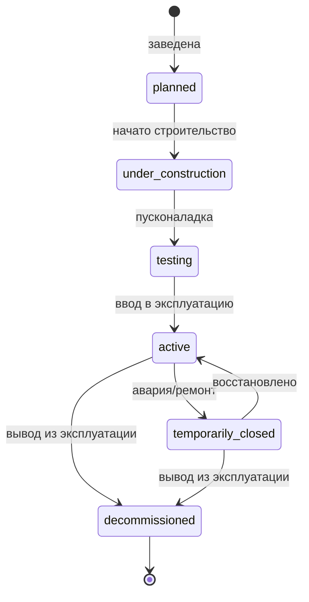

**Диаграмма состояний линии:**

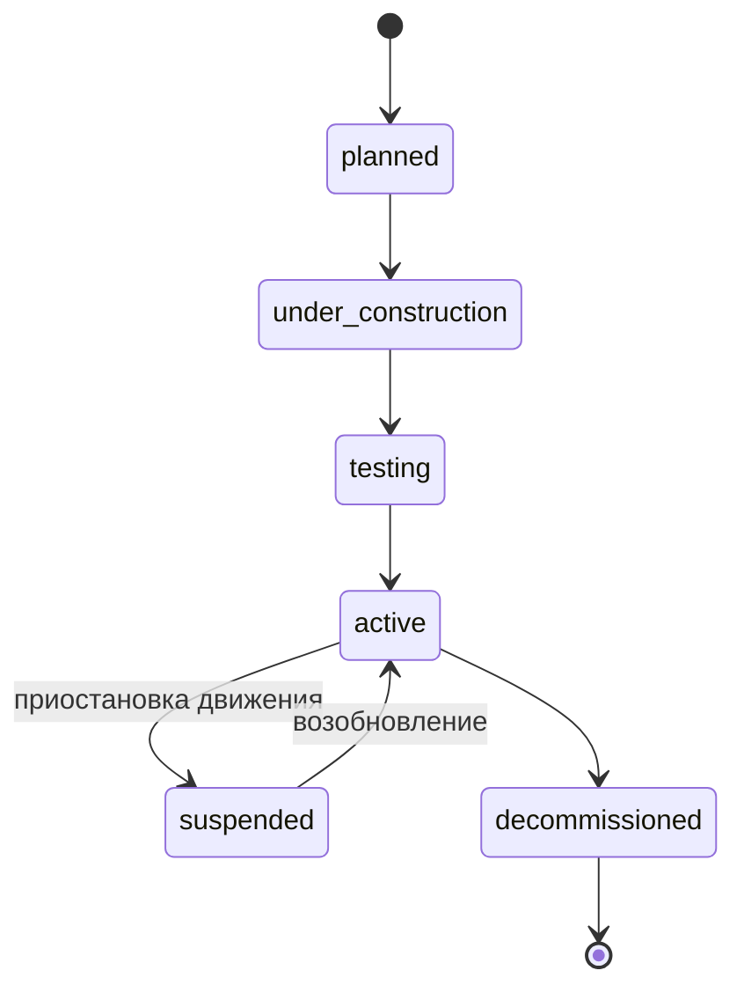

**Бизнес‑правила.**
- BR‑NET‑1: линия может стать `active` только если хотя бы две связанные станции `active` и задана валидная геометрия.
- BR‑NET‑2: удаление станции/линии — только soft‑delete; исторические версии сохраняются для аудита и воспроизведения карты на дату.
- BR‑NET‑3: изменение статуса, названия, геометрии — версионируется (effective_from/effective_to); публичный API по умолчанию отдаёт версию, действующую «на сейчас».
- BR‑NET‑4: гейт публикации — нельзя опубликовать карточку без заполненных обязательных языков (tg/ru/en) для публичных полей (см. также 8.9).
- BR‑NET‑5: стабильный внешний ID неизменен на протяжении жизненного цикла объекта, даже при смене названия/геометрии.

#### 6.2.3. Модуль маршрутизации (routing)

| Код | Требование |
|---|---|
| RTE‑01 | Маршрут станция‑станция |
| RTE‑02 | Маршрут адрес‑станция и адрес‑адрес (геокодирование + сетевая модель) |
| RTE‑03 | Учёт длительности поездки, пересадок, закрытий, частичных ограничений |
| RTE‑04 | Альтернативные маршруты |
| RTE‑05 | Ориентировочное время в пути и число пересадок |
| RTE‑06 | Задел на realtime‑коррекцию маршрута (фаза эксплуатации) |
| RTE‑07 | Режим step‑free (только доступные маршруты для ОВЗ) |
| RTE‑08 | Fare‑aware маршрутизация (с фазы билетов) — учёт тарифа/зон в ранжировании |

**Бизнес‑правила.**
- BR‑RTE‑1: маршрут не должен проходить через станции/участки со статусом «закрыто» на время поездки; при частичном ограничении — предупреждение и обход.
- BR‑RTE‑2: модель пересадки включает время перехода в узле и штраф за пересадку; ранжирование альтернатив — по (время в пути, число пересадок, доступность).
- BR‑RTE‑3: вне часов работы линии маршрут по ней не строится (учёт service hours из расписания).
- BR‑RTE‑4: в режиме step‑free исключаются узлы без объектов доступности (лифт/пандус); при неисправном лифте (см. events) узел временно исключается.
- BR‑RTE‑5: результаты маршрута кэшируются с TTL и инвалидацией при изменении статусов сети.

Диаграмма последовательности построения маршрута — см. 7.3.

#### 6.2.4. Модуль расписания и realtime (schedule‑realtime)

| Код | Требование |
|---|---|
| SCH‑01 | Базовые графики по дням недели и периодам |
| SCH‑02 | Исключения календаря (праздники, особые дни) |
| SCH‑03 | Прогнозные прибытия/отправления |
| SCH‑04 | Service alerts по станциям/линиям/участкам/диапазонам времени |
| SCH‑05 | Ручная и API‑публикация realtime‑событий |
| SCH‑06 | История изменений расписания |
| SCH‑07 | Трансляция внутреннего канона ↔ GTFS static и GTFS‑RT без потери семантики обязательных полей |
| SCH‑08 | Realtime‑доставка клиентам через WebSocket/SSE + push (FCM/APNs) |

**Бизнес‑правила.**
- BR‑SCH‑1: при конфликте источников (ручной ввод vs realtime‑фид) приоритет — у более свежего подтверждённого источника; правило приоритета настраивается администратором.
- BR‑SCH‑2: прогноз прибытия отдаётся клиенту только при валидном источнике; при устаревании данных сверх порога — помечается как «нет данных», а не отдаётся устаревшее значение.
- BR‑SCH‑3: любое изменение расписания версионируется и попадает в историю; публикация порождает событие `metro.schedule.updated`.

#### 6.2.5. Модуль уведомлений (notification)

| Код | Требование |
|---|---|
| NTF‑01 | Каналы: in‑app, push, email, опционально SMS |
| NTF‑02 | Таргетинг: вся сеть, линия, станция, сегмент, роль, гео |
| NTF‑03 | Типы: информация, предупреждение, авария, плановые работы, промо |
| NTF‑04 | Многоязычные сообщения |
| NTF‑05 | Шаблоны и отложенная публикация |
| NTF‑06 | Подтверждение доставки и повторная отправка |
| NTF‑07 | Пользовательские подписки/предпочтения и quiet hours; дедупликация и throttling |

**Бизнес‑правила.**
- BR‑NTF‑1: канал `promo` подчиняется opt‑in согласию пользователя; аварийные (`critical`) уведомления игнорируют quiet hours и обходят пользовательские отписки.
- BR‑NTF‑2: одно и то же событие не доставляется пользователю повторно (идемпотентность по event_id + user_id).
- BR‑NTF‑3: throttling — не более N маркетинговых сообщений в сутки на пользователя (настраивается).

#### 6.2.6. Модуль сервисных уведомлений и инцидентов (service alert lifecycle)

**Диаграмма состояний сервисного уведомления:**

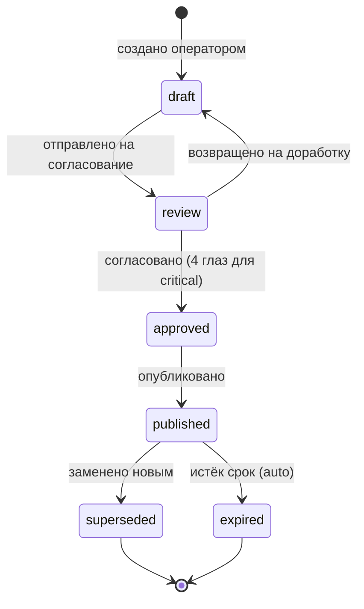

**Бизнес‑правила.**
- BR‑ALT‑1: уведомление уровня `critical` требует подтверждения вторым уполномоченным лицом (правило «4 глаз») перед публикацией.
- BR‑ALT‑2: публикация порождает событие `metro.alert.published`, инвалидацию кэша и рассылку по таргетингу; истечение `ends_at` автоматически переводит в `expired`.
- BR‑ALT‑3: инцидент/плановые работы связываются с затронутыми станциями/линиями (SERVICE_ALERT_TARGET) и влияют на маршрутизацию (BR‑RTE‑1) и карту.
- BR‑ALT‑4: все переходы состояний фиксируются в аудите с автором и временем.

Диаграмма последовательности публикации alert — см. 7.3.

#### 6.2.7. Модуль контента и медиа (content / CMS)

| Код | Требование |
|---|---|
| CMS‑01 | Новости, страницы, FAQ, баннеры, меню; многоязычность |
| CMS‑02 | Медиатека (SVG/PNG/WebP/JPEG/MP4/PDF) с правилами обработки |
| CMS‑03 | Редакционный workflow: draft → review → scheduled → published → archived |
| CMS‑04 | Отложенная публикация по расписанию |
| CMS‑05 | SEO/мета, канонические URL, редиректы |

**Бизнес‑правила.**
- BR‑CMS‑1: гейт полноты языков — публикация запрещена без заполнения обязательных языков публичных полей.
- BR‑CMS‑2: отложенная публикация исполняется фоновым планировщиком; отмена возможна до наступления времени.
- BR‑CMS‑3: удаление публичного контента — через архивирование (сохранение истории), с настройкой редиректа.

#### 6.2.8. Модуль интеграций (integration hub)

Краткие требования; детально — Раздел 7.

| Код | Требование |
|---|---|
| INT‑01 | REST API для синхронных интеграций |
| INT‑02 | Webhooks для событий |
| INT‑03 | Очереди/transactional outbox для надёжной доставки |
| INT‑04 | Импорт GeoJSON/GTFS/CSV/XLSX |
| INT‑05 | Retry с backoff, DLQ, идемпотентность, трассировка (correlation‑id) |
| INT‑06 | Версионирование API и контрактов |

#### 6.2.9. Модуль аналитики (analytics / BI)

| Код | Требование |
|---|---|
| BI‑01 | Операционный дашборд: статусы сети, импорты, уведомления, API |
| BI‑02 | Использование приложений и веба |
| BI‑03 | Маршруты и поисковые запросы |
| BI‑04 | Качество данных |
| BI‑05 | Инциденты и SLA |
| BI‑06 | Билетно‑платёжная аналитика (с фазы билетов): продажи, возвраты, reconciliation |

**Бизнес‑правила.**
- BR‑BI‑1: аналитические события (в т. ч. маршрутные запросы) хранятся в аналитическом/событийном контуре, а не в OLTP‑ядре, и обезличиваются согласно 9.3.

#### 6.2.10. Модуль администрирования (admin‑audit)

| Код | Требование |
|---|---|
| ADM‑01 | Управление пользователями и ролями |
| ADM‑02 | Справочники: линии, станции, статусы, языки, медиа |
| ADM‑03 | CMS для контента |
| ADM‑04 | Импорт/экспорт данных |
| ADM‑05 | Аудит действий (append‑only) |
| ADM‑06 | Настройка API‑клиентов, webhooks, секретов, лимитов |
| ADM‑07 | Фичефлаги и stage‑based rollout по фазам |

**Бизнес‑правила.**
- BR‑ADM‑1: изменение ролей/прав, публикация alert, импорт, изменение тарифов/расписаний — всегда с записью в аудит (актор, время, до/после).
- BR‑ADM‑2: фичефлаги управляют доступностью функций по фазам без передеплоя.

#### 6.2.11. Модуль сбора оплаты — AFC (Automated Fare Collection) [фаза билетов]

**Назначение.** Серверная часть системы контроля оплаты проезда: турникеты, валидаторы, кассы/автоматы, распространение прав проезда и стоп‑листов. Учитывает практику модернизации турникетов и QR‑оплаты в метрополитенах региона.

| Код | Требование |
|---|---|
| AFC‑01 | Реестр устройств: турникеты, валидаторы, кассы, автоматы пополнения; статусы, версии прошивок |
| AFC‑02 | Логика tap‑in / tap‑out (вход/выход), фиксация транзакций проезда |
| AFC‑03 | Поддержка носителей: QR, транспортная карта, мобильный токен, бумажный билет (fare_media) |
| AFC‑04 | Модель Account‑Based Ticketing (ABT) и/или card‑based; выбор фиксируется на ЭП |
| AFC‑05 | Офлайн‑валидация на воротах при потере связи; отложенная синхронизация транзакций |
| AFC‑06 | Формирование и распространение стоп‑листа (hotlist) на устройства; целевая латентность ≤ 5 мин (KPI 2.3) |
| AFC‑07 | Реконсиляция транзакций проезда с продажами/платежами (см. 6.2.13) |
| AFC‑08 | Служебный интерфейс контролёра: проверка билета, оформление штрафа за безбилетный проезд |
| AFC‑09 | Защищённый протокол обмена «устройство ↔ сервер» (mTLS/подпись), защита от воспроизведения |

**Бизнес‑правила.**
- BR‑AFC‑1: при офлайне валидатор принимает решение по локальному кэшу прав и стоп‑листа; транзакция буферизуется и синхронизируется при восстановлении связи (идемпотентно по transaction_id).
- BR‑AFC‑2: блокировка носителя (утеря/фрод/чарджбек) немедленно ставит его в стоп‑лист; распространение — в пределах целевой латентности.
- BR‑AFC‑3: в модели «вход/выход» незакрытый выход (tap‑in без tap‑out) обрабатывается по правилу максимального тарифа/зоны (настраивается), с возможностью корректировки.
- BR‑AFC‑4: расхождения реконсиляции (проезд без оплаты, двойное списание) регистрируются как инциденты биллинга.

**Диаграмма последовательности tap‑in/tap‑out:**

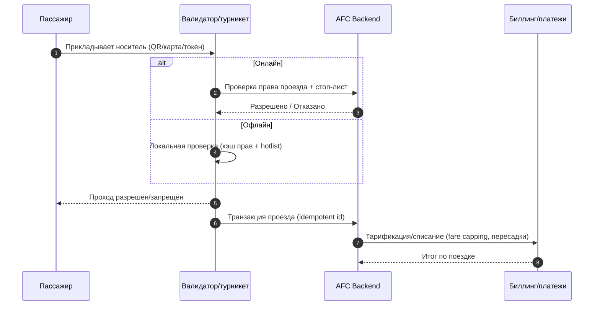

#### 6.2.12. Модуль тарифов и билетов — бизнес‑логика [ранние фазы: публикация тарифов; далее — продажи]

| Код | Требование |
|---|---|
| TKT‑01 | Публикация тарифов и правил проезда (доступно на ранних фазах) |
| TKT‑02 | Тарифные продукты: разовый билет, проездной (период), льготный билет |
| TKT‑03 | Платёжные статусы и возвраты (см. 6.2.13) |
| TKT‑04 | Носители: QR/штрихкод, токенизированный билет, карта |
| TKT‑05 | Интеграция с банковским эквайрингом (см. 6.2.13) |
| TKT‑06 | Чёрные списки и антифрод |
| TKT‑07 | Категории пассажиров и подтверждение льгот |
| TKT‑08 | Модель тарификации: зонная или плоская (решение заказчика) |
| TKT‑09 | Fare capping (суточный/недельный лимит) и правила бесплатной пересадки |

**Бизнес‑правила.**
- BR‑TKT‑1: модель тарификации (плоский тариф vs зонный) — конфигурируемый параметр; при зонной модели стоимость зависит от пары «вход‑выход» (требует tap‑out, BR‑AFC‑3).
- BR‑TKT‑2: окно бесплатной/льготной пересадки — настраиваемый интервал (напр., 90 мин) между валидациями в рамках одной поездки.
- BR‑TKT‑3: fare capping — по достижении суточного/недельного лимита последующие поездки в периоде бесплатны.
- BR‑TKT‑4: льготная категория (студент/пенсионер/льготник) применяется только после **подтверждения права** (документ/интеграция с реестром); срок действия льготы контролируется.
- BR‑TKT‑5: возврат — по правилам продукта: разовый неиспользованный билет — полный возврат; проездной — пропорциональный (частичный) за неиспользованный период; использованный билет возврату не подлежит.
- BR‑TKT‑6: безбилетный проезд фиксируется контролёром (AFC‑08) с начислением штрафа согласно тарифной политике.

**Диаграмма состояний билета:**

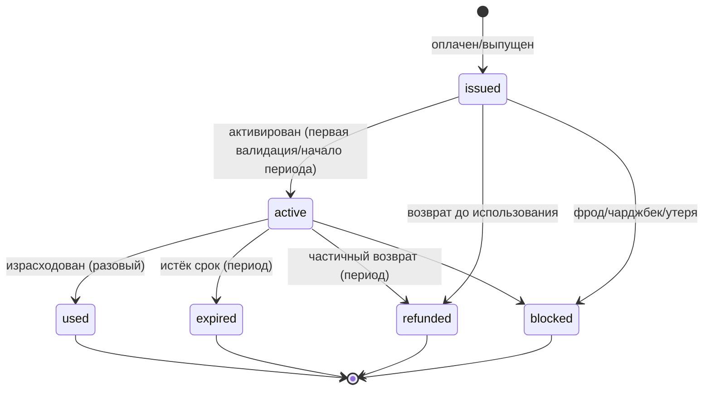

#### 6.2.13. Платёжный контур: сага и соответствие PCI DSS [фаза билетов]

| Код | Требование |
|---|---|
| PAY‑01 | Оркестрация платежа как саги: `authorize → capture → fulfil → (refund)` |
| PAY‑02 | Идемпотентность операций (Idempotency‑Key) и защита от двойного списания |
| PAY‑03 | Reconciliation и settlement с банком‑эквайрером/PSP |
| PAY‑04 | Фискализация и электронные чеки согласно требованиям РТ |
| PAY‑05 | Возвраты (полные/частичные) с обратной сагой и обновлением состояния билета |
| PAY‑06 | Антифрод, чёрные списки, лимиты |
| PAY‑07 | Минимизация PCI‑периметра: токенизация, hosted fields/redirect PSP, **запрет хранения PAN/CVV** на стороне платформы |
| PAY‑08 | Обработка вебхуков банка/PSP о статусах платежей (идемпотентно, с проверкой подписи) |

**Бизнес‑правила.**
- BR‑PAY‑1: билет переходит в `issued` только после `capture` (или подтверждённого holds‑списания); при неуспехе `capture` — компенсация (release авторизации), билет не выпускается.
- BR‑PAY‑2: чарджбек/возврат порождает блокировку билета/носителя (BR‑TKT/BR‑AFC) и попадание в стоп‑лист.
- BR‑PAY‑3: платёжные данные держателя карты не проходят и не хранятся в контуре платформы; платформа оперирует токенами и статусами.
- BR‑PAY‑4: события `metro.ticket.payment.succeeded` / `.failed` / `.refunded` публикуются в биллинговый и билетный контур.

**Диаграмма последовательности покупки билета:**

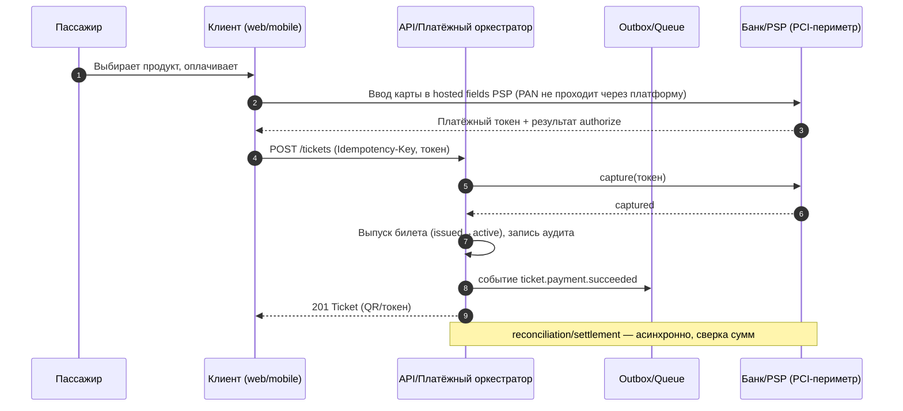

#### 6.2.14. Кабинет пассажира (passenger account) [со фазы билетов; базовый — с MVP]

| Код | Требование |
|---|---|
| ACC‑01 | Профиль пользователя, язык и настройки доступности |
| ACC‑02 | Избранное: станции, линии, сохранённые маршруты |
| ACC‑03 | Кошелёк билетов и история поездок |
| ACC‑04 | Способы оплаты (токены), история транзакций, чеки |
| ACC‑05 | Управление подписками на уведомления и quiet hours |
| ACC‑06 | Управление согласиями (consent) и запросы DSAR (см. 9.3) |

**Бизнес‑правила.**
- BR‑ACC‑1: гостевой сценарий (без регистрации) сохраняется для карты/маршрутов/уведомлений; покупка билета и история требуют аккаунта.
- BR‑ACC‑2: пользователь может отозвать согласие и инициировать удаление/экспорт своих данных (DSAR), кроме данных, обязательных к хранению по закону (напр., фискальные).

#### 6.2.15. Обращения граждан и бюро находок (citizen requests & lost‑and‑found)

| Код | Требование |
|---|---|
| REQ‑01 | Подача обращения: жалоба, предложение, сообщение об инциденте, вопрос |
| REQ‑02 | Прикрепление вложений (фото), гео‑привязка к станции/линии |
| REQ‑03 | Статус‑трекинг обращения гражданином; уведомления о смене статуса |
| REQ‑04 | Маршрутизация обращений операторам/подразделениям, SLA реакции |
| REQ‑05 | Бюро находок: каталог найденных вещей, поиск, заявка на возврат |
| REQ‑06 | Интеграция с контакт‑центром |

**Диаграмма состояний обращения:**

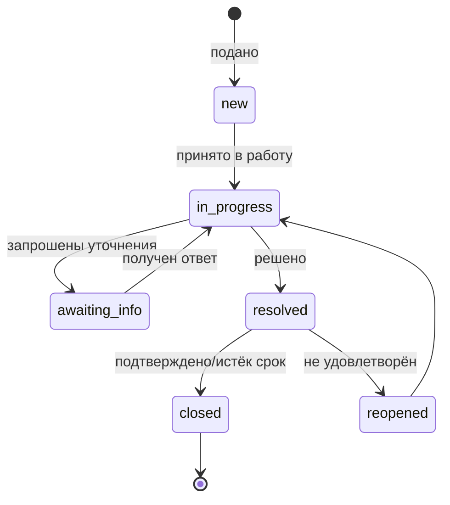

**Бизнес‑правила.**
- BR‑REQ‑1: обращение имеет SLA реакции и решения по типу/приоритету; нарушение SLA эскалируется.
- BR‑REQ‑2: заявка на возврат находки требует подтверждения признаков вещи и идентификации заявителя.

#### 6.2.16. Чрезвычайные ситуации и эвакуация (emergency)

| Код | Требование |
|---|---|
| EMG‑01 | Массовое аварийное вещание с наивысшим приоритетом (обходит quiet hours и отписки) |
| EMG‑02 | Инструкции по эвакуации и безопасности (многоязычно, доступно офлайн) |
| EMG‑03 | Интеграция с МЧС/112 и экстренными службами |
| EMG‑04 | Режим повышенной готовности: приоритизация каналов, отключение промо |
| EMG‑05 | Журналирование действий в ЧС для последующего разбора |

**Бизнес‑правила.**
- BR‑EMG‑1: активацию аварийного режима выполняет уполномоченная роль с усиленной аутентификацией (MFA) и обязательной записью в аудит.
- BR‑EMG‑2: аварийные сообщения имеют абсолютный приоритет доставки над всеми остальными.

#### 6.2.17. Открытые данные и портал разработчика (open data)

| Код | Требование |
|---|---|
| OD‑01 | Публикация GTFS Schedule и GTFS‑RT по **стабильному URL** |
| OD‑02 | Версионирование фидов, changelog, стабильные идентификаторы |
| OD‑03 | Лицензия открытых данных и условия использования |
| OD‑04 | Портал разработчика: документация OpenAPI, песочница, выпуск API‑ключей |
| OD‑05 | Публикация схемы сети в GeoJSON |

**Бизнес‑правила.**
- BR‑OD‑1: открытые данные не содержат ПДн; публикуются только справочные и агрегированные наборы.
- BR‑OD‑2: смена структуры фида сопровождается версией и периодом совместимости (7.6).

#### 6.2.18. Офлайн‑режим метро (offline‑first) — кросс‑доменное [критично]

Метро — подземная среда без устойчивого сигнала; ключевые функции обязаны работать офлайн.

| Код | Требование |
|---|---|
| OFF‑01 | Офлайн‑карта сети и станций (предзагрузка/кэш) |
| OFF‑02 | Офлайн‑расписание и справочник станций |
| OFF‑03 | Офлайн‑билет/QR: валидный проход под землёй без сети |
| OFF‑04 | Офлайн‑инструкции безопасности (EMG‑02) |
| OFF‑05 | Синхронизация при восстановлении связи (транзакции проезда, покупки) |

**Бизнес‑правила.**
- BR‑OFF‑1: QR/токен билета генерируется с криптоподписью и ограниченным сроком/счётчиком, проверяемым офлайн валидатором (BR‑AFC‑1).
- BR‑OFF‑2: офлайн‑данные помечаются временем актуальности; при устаревании клиент предупреждает пользователя.

#### 6.2.19. Унифицированный поиск и геокодирование (search)

| Код | Требование |
|---|---|
| SRCH‑01 | Единый поиск: станции, адреса, POI, контент |
| SRCH‑02 | Геокодер для сценариев «адрес → координата → ближайшая станция» |
| SRCH‑03 | Мультиязычный и устойчивый к опечаткам поиск (fuzzy) |
| SRCH‑04 | Ранжирование с учётом близости и популярности |

**Бизнес‑правила.**
- BR‑SRCH‑1: геокодер — self‑hosted (Nominatim/Pelias) или внешний с кэшированием и лимитами; при недоступности — деградация к поиску по справочнику станций.

#### 6.2.20. Навигация внутри станции — wayfinding / indoor (задел)

| Код | Требование |
|---|---|
| WAY‑01 | Модель схем станций и переходов (задел на будущие фазы) |
| WAY‑02 | Привязка выходов к наземным ориентирам |
| WAY‑03 | Задел на indoor‑навигацию и доступные маршруты внутри узла |

#### 6.2.21. Прочие кросс‑доменные требования

| Код | Требование |
|---|---|
| XD‑01 | Загрузка вагонов (как в референсных метро): источник realtime‑данных, отображение, деградация при отсутствии данных |
| XD‑02 | Мультимодальные пересадки (metro‑bus‑trolleybus), задел на ITS |
| XD‑03 | Деградационный режим (degraded mode) при пиковой нагрузке/сбоях внешних сервисов |

### 6.3. Требования к видам обеспечения

#### 6.3.1. Информационное обеспечение (модель данных)

Канонические геоданные хранятся в PostGIS; публичная визуализация — через MapLibre‑совместимый стиль и геослои. Маршрутные поиски и аналитические события хранятся в аналитическом/событийном контуре, а не в OLTP‑ядре.

**ER‑диаграмма (ядро):**

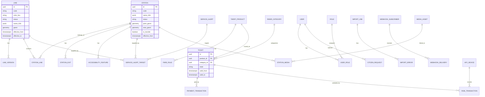

Основные сущности (полный словарь — Приложение 15.3): line, line_version, station, station_exit, transfer_hub, accessibility_feature, service_alert, service_alert_target, schedule_version, trip, arrival_prediction, tariff_product, fare_rule, rider_category, ticket, payment_transaction, afc_device, ride_transaction, citizen_request, lost_found_item, media_asset, document_asset, import_job, import_error, webhook_subscriber, webhook_delivery, user, role, permission, api_client, audit_event, feature_flag, consent_record.

**Пример DDL (фрагмент):**

```sql
CREATE EXTENSION IF NOT EXISTS postgis;

CREATE TABLE metro_line (
    id UUID PRIMARY KEY,
    code VARCHAR(32) NOT NULL UNIQUE,
    color_hex VARCHAR(7) NOT NULL,
    status VARCHAR(32) NOT NULL,
    name_i18n JSONB NOT NULL,
    sort_order INT NOT NULL DEFAULT 0,
    geom geometry(MultiLineString, 4326),
    effective_from TIMESTAMPTZ NOT NULL DEFAULT now(),
    effective_to TIMESTAMPTZ,
    created_at TIMESTAMPTZ NOT NULL DEFAULT now(),
    updated_at TIMESTAMPTZ NOT NULL DEFAULT now()
);

CREATE TABLE metro_station (
    id UUID PRIMARY KEY,
    code VARCHAR(64) NOT NULL UNIQUE,
    status VARCHAR(32) NOT NULL,
    name_i18n JSONB NOT NULL,
    description_i18n JSONB,
    point_geom geometry(Point, 4326) NOT NULL,
    area_geom geometry(Polygon, 4326),
    is_transfer BOOLEAN NOT NULL DEFAULT false,
    attrs JSONB NOT NULL DEFAULT '{}'::jsonb,
    effective_from TIMESTAMPTZ NOT NULL DEFAULT now(),
    created_at TIMESTAMPTZ NOT NULL DEFAULT now(),
    updated_at TIMESTAMPTZ NOT NULL DEFAULT now()
);

CREATE INDEX ix_metro_line_geom ON metro_line USING GIST (geom);
CREATE INDEX ix_metro_station_point_geom ON metro_station USING GIST (point_geom);
CREATE INDEX ix_metro_station_name_i18n_gin ON metro_station USING GIN (name_i18n);
```

**Справочники (master data):** status_line, status_station, accessibility_type (elevator, escalator, ramp, tactile, audio_assist), alert_severity (info, warning, critical), language (tg, ru, en), fare_media (qr, card, mobile_token, paper), rider_category (adult, child, student, senior, privileged).

#### 6.3.2. Программное обеспечение: модульная декомпозиция

**Компонентная схема:**

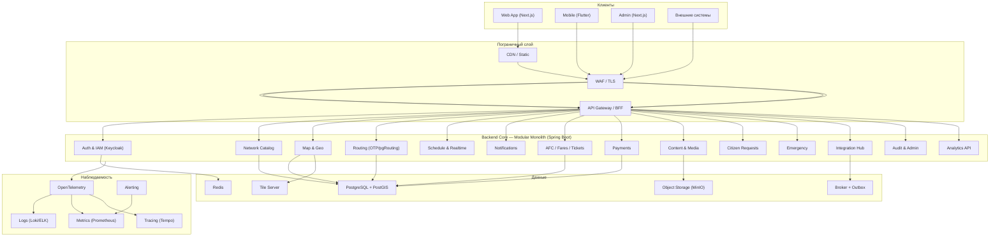

| Модуль | Границы | Вынесение в сервис |
|---|---|---|
| auth | пользователи, клиенты, токены, сессии, RBAC/ABAC | высокая |
| network-catalog | линии, станции, выходы, справочники | высокая |
| map-geo | геометрии, карты, слои, гео‑запросы | высокая |
| routing | граф сети, алгоритмы | высокая |
| schedule-realtime | графики, события, статусы | высокая |
| fares-tickets-afc | тарифы, продукты, билеты, устройства, транзакции проезда | высокая |
| payments | сага, эквайринг, возвраты | высокая |
| content | новости, страницы, медиа | средняя |
| notification | шаблоны, рассылки, push | высокая |
| citizen-requests | обращения, находки | средняя |
| emergency | ЧС, вещание | средняя |
| integration | webhooks, коннекторы, import/export, retry | высокая |
| admin-audit | аудит, настройки, фичефлаги | средняя |

#### 6.3.3. Информационная безопасность и IAM (уточнение архитектуры)

Собственный сервер авторизации — **Keycloak** (OAuth 2.0 / OIDC), выдающий JWT для граждан, операторов и M2M‑клиентов. Backend работает как **OAuth2 resource server** (Spring Security), проверяя токены. Внешний государственный IdP подключается позднее как **федерация/брокеринг** через Keycloak, без переписывания приложений. Для особо чувствительных интеграций — client credentials + mTLS. Это устраняет противоречие ред. 1.0 (E‑2).

#### 6.3.4. Критерии выбора компонентов (финализация на ЭП)

| Компонент | Кандидаты | Критерии выбора |
|---|---|---|
| Движок маршрутизации | OpenTripPlanner, pgRouting, GraphHopper | мультимодальность, поддержка GTFS, realtime‑коррекция, лицензия, self‑host |
| Геокодер | Nominatim, Pelias, внешний | покрытие адресов Душанбе, многоязычность (tg/ru/en), self‑host, лицензия данных |
| Брокер | RabbitMQ, Kafka | пропускная способность, DLQ, простота эксплуатации на старте |
| Тайл‑сервер | Martin, pg_tileserv, Tileserver‑GL | генерация из PostGIS, производительность, кэш |

#### 6.3.5. Прочие виды обеспечения

- **Лингвистическое:** i18n‑словари, многоязычные поля БД, форматирование дат/чисел/валюты (см. 8.9).
- **Техническое:** серверные мощности гос. ЦОД, сеть, резервные каналы, оборудование AFC (интеграция).
- **Организационное:** роли эксплуатации, регламенты, обучение (Раздел 12, 14).
- **Методическое:** руководства, runbook‑и, playbooks (Раздел 12).
- **Правовое:** соответствие законодательству РТ о ПДн и об электронном документе/подписи (Раздел 9).

---

## Раздел 7. Требования к интеграциям и API

### 7.1. Базовые правила API

Публичные и служебные API описываются в **OpenAPI 3.1** (включая `webhooks`). Аутентификация — OAuth 2.0; access token — JWT; для M2M — client credentials, для чувствительных интеграций — mTLS. Гео‑форматы — RFC 7946 GeoJSON; транспортные выгрузки — GTFS static / GTFS‑RT.

| Правило | Требование |
|---|---|
| Версионирование | `/api/v1/...` |
| Формат | `application/json`, GeoJSON для геосервисов |
| Идемпотентность | обязательна для POST интеграций через `Idempotency-Key` |
| Pagination | cursor‑based для больших списков |
| Ошибки | единый error envelope (7.5) |
| Локализация | `Accept-Language` + явный `lang` |
| Security | OAuth2/JWT для защищённых API |
| Webhooks | подпись payload + retry policy + replay protection |
| Observability | correlation‑id/request‑id обязательны |
| Rate limiting | лимиты по тарифу клиента (публичный/партнёр/внутренний) |

### 7.2. Пример OpenAPI (фрагмент)

```yaml
openapi: 3.1.0
info:
  title: Metro Dushanbe API
  version: 1.0.0
  summary: Публичный и служебный API платформы «Метро Душанбе»
servers:
  - url: https://api.metro.dushanbe.tj
security:
  - oauth2: [metro.read]
paths:
  /api/v1/lines:
    get:
      summary: Список линий
      tags: [network]
      parameters:
        - in: query
          name: status
          schema: { type: string, enum: [planned, under_construction, testing, active, suspended] }
      responses: { "200": { description: OK } }
  /api/v1/stations/{stationId}:
    get:
      summary: Карточка станции
      tags: [network]
      parameters:
        - in: path
          name: stationId
          required: true
          schema: { type: string }
      responses: { "200": { description: OK } }
  /api/v1/routes:
    get:
      summary: Построение маршрута
      tags: [routing]
      parameters:
        - in: query
          name: from
          schema: { type: string }
        - in: query
          name: to
          schema: { type: string }
        - in: query
          name: mode
          schema: { type: string, enum: [metro_only, multimodal, step_free] }
      responses: { "200": { description: Route result } }
components:
  securitySchemes:
    oauth2:
      type: oauth2
      flows:
        authorizationCode:
          authorizationUrl: https://auth.metro.dushanbe.tj/oauth2/authorize
          tokenUrl: https://auth.metro.dushanbe.tj/oauth2/token
          scopes:
            metro.read: read public transport data
            metro.write: manage transport data
webhooks:
  metro.alert.published:
    post:
      requestBody:
        required: true
        content:
          application/json:
            schema: { $ref: '#/components/schemas/ServiceAlertEvent' }
      responses: { "200": { description: accepted } }
```

### 7.3. Ключевые диаграммы последовательности

**Построение маршрута (с кэшем):**

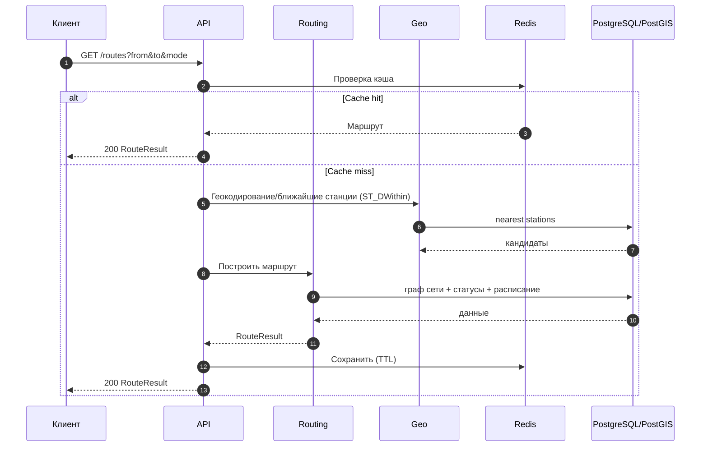

**Публикация service alert:**

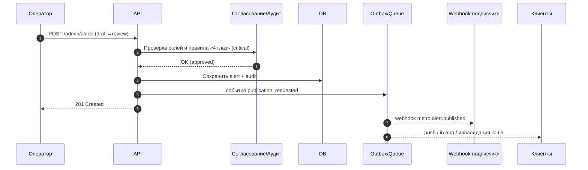

**Импорт данных (preview → diff → apply):**

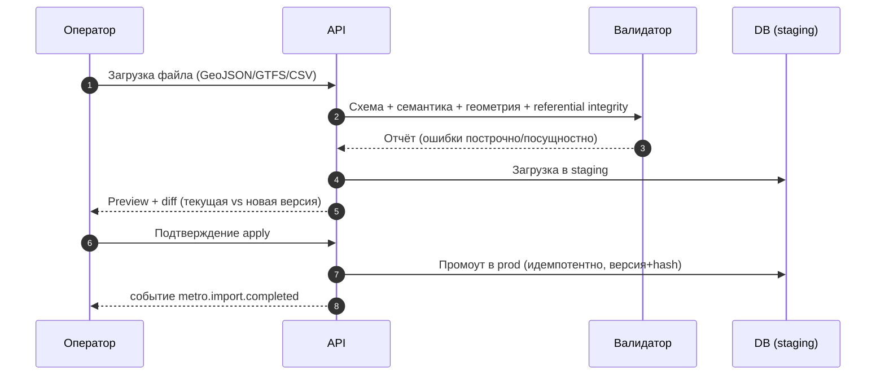

### 7.4. Каталог доменных событий (webhooks)

| Событие | Когда | Подписчики |
|---|---|---|
| `metro.alert.published` | опубликовано сервисное предупреждение | городской портал, табло, партнёры |
| `metro.alert.expired` | истёк срок alert | табло, кэш |
| `metro.schedule.updated` | обновлено расписание | интеграторы, BI |
| `metro.station.status.changed` | изменилась доступность станции | ITS, info‑panels |
| `metro.ticket.payment.succeeded` | успешная покупка | платёжный и билетный контур |
| `metro.ticket.payment.failed` | неуспешная оплата | биллинг |
| `metro.ticket.refunded` | возврат | биллинг, аудит |
| `metro.hotlist.updated` | обновлён стоп‑лист | валидаторы/AFC |
| `metro.import.completed` | завершён импорт | admin tooling |
| `metro.emergency.activated` | активирован аварийный режим | МЧС/112, все каналы |
| `metro.request.status.changed` | смена статуса обращения | контакт‑центр, заявитель |

### 7.5. Канонический формат ошибок и каталог кодов

```json
{
  "timestamp": "2026-07-04T12:15:00Z",
  "requestId": "3f4c2d1a-3d5d-4b0f-9d45-0d5f4b63fabc",
  "error": {
    "code": "station.not_found",
    "message": "Станция не найдена",
    "details": { "stationId": "station-9999" }
  }
}
```

| Код | HTTP | Значение |
|---|---|---|
| `validation.failed` | 400 | Ошибка валидации запроса |
| `auth.unauthorized` | 401 | Нет/невалидный токен |
| `auth.forbidden` | 403 | Недостаточно прав (RBAC/ABAC) |
| `station.not_found` / `line.not_found` | 404 | Объект не найден |
| `route.not_found` | 404 | Маршрут не построен |
| `idempotency.conflict` | 409 | Конфликт идемпотентного ключа |
| `import.invalid` | 422 | Ошибка семантики/геометрии импорта |
| `payment.declined` | 402 | Платёж отклонён |
| `rate_limited` | 429 | Превышен лимит запросов |
| `internal.error` | 500 | Внутренняя ошибка |

### 7.6. Политика версионирования и депрекации публичного API

- Обратно совместимые изменения — в рамках `v1`. Ломающие — только в новой мажорной версии (`v2`).
- Депрекация публичного эндпоинта — с уведомлением не менее чем за **12 месяцев** и периодом параллельной поддержки.
- Изменения структуры открытых данных (GTFS) — с версией фида и changelog (BR‑OD‑2).

### 7.7. Целевой перечень интеграций и паттерны

| Система | Назначение | Тип обмена |
|---|---|---|
| Минтранс РТ | нормативные/справочные данные, официальные новости | API / manual sync |
| Органы города Душанбе | события, дорожные работы, городские уведомления | API / webhooks |
| МВД / УГАИ | дорожные ограничения, безопасность, перекрытия | secured exchange |
| МЧС / 112 | ЧС, эвакуация | secured exchange / event |
| Банки / PSP | оплата билетов, возвраты, эквайринг | API (PCI) |
| ITS | статусы транспортной инфраструктуры | API / event stream |
| GPS / телеметрия | realtime‑позиции для мультимодального слоя | API / queue |
| Общественный транспорт | пересадки metro‑bus‑trolleybus | GTFS / API |
| Городской портал / суперприложение | публикация карты и событий | API / widget / webhooks |
| Контакт‑центр | статусы сервисных инцидентов и обращений | API |

Паттерны: REST sync (чтение справочников), Webhooks (события), Batch import (гео/расписания), Queue/outbox (гарантированная доставка), Retry with backoff, DLQ (ручная обработка), Idempotent consumer. Требования устойчивости: correlation‑id на каждой операции (RET‑01), экспоненциальный backoff (RET‑02), DLQ (RET‑03), логирование всех webhook‑попыток (RET‑04), проверка схемы и подписи входящих payload (RET‑05).

---

## Раздел 8. Требования к UX/UI и дизайн‑системе

### 8.1. UX‑принципы

Платформа используется всем населением и органами города; UX — система с низким порогом входа, а не дизайнерский showcase.
1. Карта — первый экран, но не единственный.
2. Любой сценарий с карты имеет альтернативу в списке (list mode) — требование доступности.
3. На каждом экране есть явный ответ: «где я?», «куда ехать?», «что закрыто?», «сколько стоит?», «как оплатить?», «что делает город сейчас?».
4. Административный интерфейс — operational console, а не generic CMS.
5. i18n и accessibility не добавляются постфактум.

### 8.2. Информационная архитектура

| Web / Mobile гражданина | Admin / Operator |
|---|---|
| Главная | Операционная сводка |
| Карта | Линии / Станции |
| Станции | Расписания |
| Маршруты | Service alerts / Инциденты |
| Уведомления | Импорты данных |
| Тарифы и билеты | Контент |
| Кабинет пассажира | AFC / Билеты / Платежи |
| Обращения / Находки | Обращения граждан |
| Новости | Пользователи и роли |
| Помощь / FAQ | Интеграции / Webhooks / Аудит |
| Настройки языка и доступности | ЧС / Аварийный режим |

### 8.3. Состав экранов MVP

| Экран | Web | Mobile | Admin |
|---|---|---|---|
| Главная карта | Да | Да | Да |
| Карточка станции | Да | Да | Да |
| Маршрут | Да | Да | Нет |
| Уведомления | Да | Да | Да |
| Новости | Да | Да | Да |
| Тарифы | Да | Да | Да |
| Обращения | Да | Да | Да |
| Справочники / Импорт / Аудит | Нет | Нет | Да |

### 8.4. Операционный дашборд (структурный макет — иллюстрация)

> Не финальный дизайн, а структура экрана. Числовые значения условны.

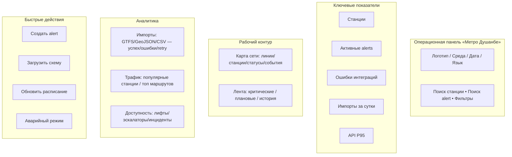

### 8.5. Цвета и дизайн‑система (приведено к брендовому логотипу)

Палитра основана на официальном логотипе `photo/dushanbe_metro_logo.svg` (цвета флага Таджикистана: красный, белый, зелёный + фирменный тёмно‑синий). **Исправляет несоответствие ред. 1.0 (E‑1).** Шрифт бренда — **Montserrat**.

| Назначение | Цвет | Источник |
|---|---|---|
| Primary (Navy) | `#082742` | Логотип (navy) |
| Accent (Red) | `#E21B2D` | Логотип (red / буква M) |
| Secondary (Green) | `#138A3D` | Логотип (green / TAJIKISTAN) |
| Surface light | `#FFFFFF` | Логотип (white) |
| Surface muted | `#F2F5F8` | Производный |
| Surface dark | `#0B1622` | Производный от navy |
| Text primary | `#082742` | navy |
| Text secondary | `#3A4A5A` | Производный |
| Text inverse | `#FFFFFF` | white |
| Success | `#138A3D` | = brand green |
| Warning | `#E08600` | Производный (контраст AA) |
| Danger / Critical | `#E21B2D` | = brand red |
| Info | `#0E5A8A` | Производный от navy |

**Правила контраста.** Все семантические сочетания «текст/фон» проходят WCAG 2.2 AA (≥ 4,5:1 для обычного текста; ≥ 3:1 для крупного и UI‑компонентов). Красный `#E21B2D` не используется как единственный носитель смысла (дублируется иконкой/текстом). Токены дизайн‑системы поставляются в едином формате для web/admin/mobile.

### 8.6. Компоненты и адаптивность

| Компонент | Требование |
|---|---|
| App Shell | единая навигация web/admin/mobile |
| Map Container | адаптивная высота, skeleton loading, list‑mode |
| Station Card | название, выходы, доступность, фото, статусы |
| Alert Banner | severity, иконка, сроки, CTA |
| Route Card | время, пересадки, статус, альтернативы, step‑free |
| Ticket / Wallet | QR/токен, статус, срок, офлайн‑доступность |
| KPI Card | заголовок, значение, дельта, sparkline |
| Table | сортировка, фильтрация, сохранённые представления |
| Timeline | ремонты, публикации, аудит |
| Drawer / Bottom Sheet | mobile‑паттерн |

| Breakpoint | Назначение |
|---|---|
| ≤ 480 px | компактный mobile |
| 481–768 px | large mobile / small tablet |
| 769–1200 px | tablet / small desktop |
| ≥ 1201 px | desktop / operations console |

### 8.7. Доступность (WCAG 2.2 AA) — единый доступный интерфейс

**Исправляет E‑4:** вместо отдельной «версии для слабовидящих» — единый интерфейс с режимами. Отдельный упрощённый профиль допускается только как дополнительная опция, не как основной путь.

| Код | Требование |
|---|---|
| A11Y‑01 | Контраст AA во всех основных сценариях |
| A11Y‑02 | Skip links и landmark roles |
| A11Y‑03 | Читаемые статусы и ошибки форм |
| A11Y‑04 | Полная клавиатурная навигация |
| A11Y‑05 | Описания для иконок и не‑текстовых элементов (aria) |
| A11Y‑06 | Текстовые альтернативы карте и схемам (list/station mode) |
| A11Y‑07 | Screen reader announcement для сервисных alerts |
| A11Y‑08 | Режимы: высокий контраст, крупный шрифт (до 200% без потери функций), уменьшенная анимация |

### 8.8. Офлайн‑UX

Мобильные экраны карты, расписания, кабинета билетов и инструкций безопасности имеют офлайн‑состояние с индикацией актуальности данных (см. 6.2.18).

### 8.9. Локализация (i18n)

| Код | Требование |
|---|---|
| I18N‑01 | Все строки вынесены в словари |
| I18N‑02 | RTL не обязателен на первой фазе, но layout не должен ломаться |
| I18N‑03 | Станции/линии/контент — в i18n JSON‑полях |
| I18N‑04 | Язык: профиль → `Accept-Language` → default |
| I18N‑05 | Цепочка фолбэков языков; плюрализация; форматы дат/чисел; валюта TJS (сомони) |
| I18N‑06 | Единый i18n‑workflow (централизованное управление переводами) |

---

## Раздел 9. Требования к безопасности и соответствию

### 9.1. Базовая security‑модель

| Направление | Требование |
|---|---|
| IAM | централизованное управление пользователями, ролями, клиентами, scopes (Keycloak) |
| SSO | поддержка внешнего IdP (федерация) |
| MFA | обязательно для admin/operator и активации ЧС |
| RBAC | базовая ролевая модель для всех экранов и API |
| ABAC | атрибутные ограничения для действий и контуров данных |
| Secrets | вне кода, во внешнем хранилище, ротация (Vault/HSM) |
| Encryption in transit | TLS 1.2+ |
| Encryption at rest | шифрование дисков, бэкапов и чувствительных полей |
| Audit | полная трасса изменений критичных сущностей (append‑only) |
| Anti‑abuse | rate limiting, anomaly detection, brute‑force protection |
| SDLC | OWASP ASVS как базовый verification checklist; SAST/DAST/dependency scan в CI |

### 9.2. Матрица ролей (фрагмент)

| Действие | Гражданин | Оператор | Админ | Аудитор | Контролёр | Интегратор |
|---|---|---|---|---|---|---|
| Смотреть карту/тарифы | Да | Да | Да | Да | Да | Через API |
| Публиковать alert | Нет | Да | Да | Нет | Нет | Нет |
| Согласовать critical alert (4 глаз) | Нет | Уполномоч. | Да | Нет | Нет | Нет |
| Загружать GeoJSON/GTFS | Нет | Да | Да | Нет | Нет | По API/ETL |
| Проверять билет / штраф | Нет | Нет | Нет | Нет | Да | Нет |
| Активировать ЧС | Нет | Уполномоч.+MFA | Да+MFA | Нет | Нет | Нет |
| Управлять ролями | Нет | Нет | Да | Нет | Нет | Нет |
| Читать аудит | Нет | Частично | Да | Да | Нет | Нет |
| Настраивать webhooks | Нет | Нет | Да | Нет | Нет | Нет |

### 9.3. Приватность и защита персональных данных (закон РТ о ПДн)

| Код | Требование |
|---|---|
| PRIV‑01 | Privacy by design & by default; data minimization; purpose limitation |
| PRIV‑02 | Управление согласиями (consent) с версионированием и журналом |
| PRIV‑03 | Обработка запросов субъекта ПДн (DSAR): доступ, экспорт, удаление (с учётом обязательного хранения) |
| PRIV‑04 | Инвентаризация ПДн (реестр обработки, ROPA) и классификация данных |
| PRIV‑05 | Псевдонимизация/обезличивание в аналитике и нижних средах |
| PRIV‑06 | Retention: сроки хранения по категориям (аудит, транзакции, аналитика), автоматическая архивация/удаление |
| PRIV‑07 | PII‑scrubbing в логах и трейсинге |
| PRIV‑08 | Резидентность ПДн в РТ (HOST‑02) |

### 9.4. Соответствие PCI DSS (платёжный контур)

| Код | Требование |
|---|---|
| PCI‑01 | Минимизация периметра: платформа не хранит/не передаёт PAN/CVV (PAY‑07) |
| PCI‑02 | Токенизация и hosted fields/redirect PSP |
| PCI‑03 | Изолированный сетевой сегмент платежей (HOST‑04) |
| PCI‑04 | Управление ключами и секретами платежей (HSM/Vault) |
| PCI‑05 | Логирование и мониторинг платёжных операций; хранение согласно требованиям |
| PCI‑06 | Регулярный security‑скан и пентест платёжного контура |

### 9.5. Электронный документ и подпись; юридическая значимость

Служебный контур поддерживает юридически значимые электронные действия (утверждение, публикация) с применением защищённой электронной подписи согласно законодательству РТ об электронном документе и электронной подписи. Интеграции, затрагивающие гражданские реестры, банковские транзакции или биометрию, проходят отдельную юридическую проверку на этапе правового дизайна (ЭП).

### 9.6. Логирование и SIEM

Логируются: вход/неуспешный вход, выдача токена, изменение ролей/прав, публикация alert, импорт данных, ошибки интеграций, изменение тарифов/расписаний, операции с билетами, активация ЧС, доступ к ПДн. События направляются в SIEM; настраиваются корреляционные правила и алерты по аномалиям (см. метрики безопасности 6.1 и Приложение 15.7).

---

## Раздел 10. Состав и содержание работ по созданию системы (стадии создания)

Стадии соответствуют ГОСТ 34.601. Календарный горизонт (2026–2033) — **проектный план платформы**, привязанный к публично подтверждённым этапам подготовки ТЭО/проектирования 2026–2028 и к необходимости иметь полнофункциональный цифровой контур к запуску первой эксплуатационной очереди. Это **не** утверждённый государством календарь строительства метро.

### 10.1. Стадии по ГОСТ 34.601 и результаты

| Стадия | Содержание | Результат |
|---|---|---|
| Формирование требований | Обследование, BRD, настоящее ТЗ | Утверждённое ТЗ |
| Разработка концепции | Варианты решения, PoC карты | Концепция, PoC |
| Эскизный проект (ЭП) | Финализация выбора компонентов (6.3.4), правовой дизайн, модель данных | Документы ЭП |
| Технический проект (ТП) | Детальное проектирование модулей, API, БД, UX | Документы ТП |
| Рабочая документация (РД) | Реализация, конфигурации, миграции | Исходный код, РД |
| Ввод в действие | Пуско‑наладка, опытная эксплуатация, обучение | Приёмочные акты |
| Сопровождение | Гарантия и развитие | SLA сопровождения |

### 10.2. Рекомендуемая фазировка платформы (проектный план)

| Фаза | Период | Результат |
|---|---|---|
| Подготовка | 2026–2027 | ТЗ, модель данных, архитектура, дизайн‑система, прототипы, PoC карты |
| MVP публичной платформы | 2027–2028 | web/mobile с картой проектируемой сети, карточками линий/станций, новостями, alerts, обращениями, admin |
| Операционная готовность | 2028–2029 | импорты GTFS/GeoJSON, интеграции с ITS/городом, аудит, дашборды, SLA‑эксплуатация |
| Расширение транспорта | 2029–2030 | мультимодальные пересадки, richer routing, открытые данные, портал разработчика |
| Билетный контур | 2030–2031 | тарифный движок, билеты, AFC, QR/эквайринг, платёжная сага, кабинет пассажира |
| Предзапуск эксплуатации | 2031–2032 | rehearsal эксплуатационных сценариев, realtime, observability, нагрузочные тесты, офлайн |
| Готовность к вводу линии | 2032–2033 | production hardening, DR, масштабирование, массовый public rollout |

---

## Раздел 11. Порядок контроля и приёмки системы

### 11.1. Виды испытаний

| Вид | Обязательность |
|---|---|
| Unit | Да |
| Integration | Да |
| Contract (Pact / Spring Cloud Contract) | Да |
| E2E | Да |
| Performance / Load (k6/JMeter/Gatling) | Да |
| Security / Pen‑test (OWASP ASVS) | Да |
| Accessibility (axe + ручной аудит, screen readers) | Да |
| UAT | Да |
| Data migration rehearsal | Да |
| Disaster recovery rehearsal | Да |
| PCI‑скан платёжного контура | Да (фаза билетов) |

### 11.2. Стадии приёмки (ГОСТ 34.601)

Предварительные испытания → опытная эксплуатация → приёмочные испытания с оформлением актов. Состав приёмочной комиссии определяется заказчиком. Критерии готовности — по KPI (2.3) и критериям ниже.

### 11.3. Критерии приёмки

| Категория | Критерий |
|---|---|
| Функциональность | Все Must‑требования пройдены в UAT (трассировка по RTM) |
| Производительность | P95 и SLA соответствуют утверждённым целям (с учётом фазы) |
| Безопасность | Нет открытых критических/высоких уязвимостей без согласованного исключения; пройден PCI‑скан (для билетов) |
| UX | Основные сценарии без блокирующих замечаний |
| i18n | tg/ru/en покрывают все критические экраны |
| Accessibility | Ключевые сценарии соответствуют WCAG 2.2 AA |
| Интеграции | Все обязательные интеграции отработали тестовые сценарии |
| Данные | 100% обязательных сущностей со стабильными ID и геометрией |
| Эксплуатация | Мониторинг, бэкап, rollback, DRP проверены |
| Документация | Предоставлен полный пакет тех. и пользовательской документации |

### 11.4. Классификация инцидентов и время реакции

| Приоритет | Определение | Реакция | Восстановление |
|---|---|---|---|
| P1 | Полный отказ критичного контура (платежи/публичный доступ/ЧС) | ≤ 15 мин | ≤ 30 мин (RTO) |
| P2 | Серьёзная деградация без полного отказа | ≤ 30 мин | ≤ 4 ч |
| P3 | Ограниченное влияние, есть обходной путь | ≤ 4 ч | ≤ 2 сут |
| P4 | Незначительное/косметическое | ≤ 1 сут | по плану релизов |

### 11.5. Нагрузочные сценарии

Пиковый просмотр карты (массовая публикация новостей/инцидентов); пик маршрутного поиска (утро/вечер, изменение режима линии); массовая доставка alerts (аварийный сценарий); импорт большой схемы; платёжный пик (запуск билетов); массовая валидация на входах (AFC, час пик).

---

## Раздел 12. Требования к документированию, поставке, гарантии

### 12.1. Состав документации (ГОСТ 34.201)

| Документ | Обязателен |
|---|---|
| Архитектурное описание | Да |
| API handbook / OpenAPI bundle | Да |
| ER‑модель и словарь данных | Да |
| Runbook эксплуатации | Да |
| Incident playbooks | Да |
| Руководство администратора | Да |
| Руководство оператора | Да |
| Руководство контент‑менеджера | Да |
| Руководство интегратора | Да |
| Руководство контролёра (AFC) | Да (фаза билетов) |
| User help / FAQ | Да |
| Программа и методика испытаний (ПМИ) | Да |

### 12.2. Состав поставки, исходный код, лицензии и IP

| Код | Требование |
|---|---|
| DLV‑01 | Передача исходного кода заказчику (или в согласованный репозиторий) |
| DLV‑02 | Права на результат (IP) — согласно государственному контракту; приоритет open‑source стека и открытых форматов для избежания vendor lock‑in |
| DLV‑03 | Полный перечень используемых лицензий (OSS compliance), отсутствие несовместимых лицензий |
| DLV‑04 | Возможность **эскроу** исходного кода при использовании проприетарных компонентов |
| DLV‑05 | Инфраструктура как код (IaC), конфигурации сред, скрипты миграций |

### 12.3. Гарантия и сопровождение

Гарантийный период и условия сопровождения (SLA исполнителя, окна обслуживания, порядок обновлений безопасности) определяются контрактом; минимально — устранение дефектов, критичных уязвимостей и поддержка совместимости на гарантийный срок.

---

## Раздел 13. Требования к миграции и вводу данных

Миграция здесь — не только перенос из старых ИС, но и **поэтапное накопление доверенного мастер‑набора данных**: сначала проектные GeoJSON/таблицы/чертежи, затем GTFS static, далее realtime и тарифные потоки. Обязателен Data Intake Pipeline с валидацией схем, нормализацией идентификаторов и версионированием импортов; публикация — по стабильному URL со стабильными идентификаторами.

### 13.1. Этапы миграции

| Этап | Содержание |
|---|---|
| Data discovery | инвентаризация источников геометрий, справочников, медиа, проектных файлов |
| Canonical model | утверждение внутренней схемы line/station/alerts/fares/users/integrations |
| Cleanse | очистка дублей, нормализация кодов и языков |
| Import adapters | коннекторы GeoJSON, GTFS, CSV/XLSX |
| Validation | схема, семантика, геометрия, referential integrity |
| Rehearsal | пробные импорты на stage |
| Cutover | загрузка в prod, freeze старых источников |
| Post‑cutover QA | контроль целостности, пользовательские проверки |

### 13.2. Правила импорта

| Код | Требование |
|---|---|
| IMP‑01 | Каждый импорт: source system, source file, hash, version, operator |
| IMP‑02 | Идемпотентность импорта |
| IMP‑03 | Ошибки — построчно и посущностно |
| IMP‑04 | Обязательный preview перед применением |
| IMP‑05 | Diff между текущей и новой версией |

### 13.3. Форматы данных

| Формат | Назначение |
|---|---|
| GeoJSON (RFC 7946) | линии, станции, выходы, зоны |
| GTFS Schedule | справочник сети и расписания |
| GTFS Realtime | оперативные изменения |
| GTFS Fares v2 (целевой, где применимо) | тарифы при запуске билетов |
| CSV/XLSX | массовые административные загрузки |
| Media assets | SVG/PNG/WebP/JPEG/MP4/PDF по правилам |

---

## Раздел 14. Ресурсы, оценка трудозатрат и риски

### 14.1. Роли и загрузка (ориентировочно)

| Роль | Загрузка |
|---|---|
| Product owner / госзаказчик | 0,5–1 FTE |
| Project manager | 1 FTE |
| Solution architect | 1 FTE |
| Backend engineers | 3–6 FTE |
| Frontend engineers | 2–4 FTE |
| Flutter engineers | 2–4 FTE |
| QA engineers | 2–4 FTE |
| DevOps/SRE | 1–2 FTE |
| UX/UI designers | 1–2 FTE |
| Data/BI engineer | 1–2 FTE |
| Security engineer | 0,5–1 FTE |
| Business/System analyst | 1–2 FTE |

### 14.2. Оценка по блокам (ориентировочно)

| Блок | Оценка |
|---|---|
| Discovery, BRD, UX, architecture | 8–14 недель |
| MVP public + admin | 5–8 месяцев |
| Integrations + analytics + observability | 3–5 месяцев |
| AFC + tickets/fare engine + payments | 5–8 месяцев |
| Hardening, UAT, rollout | 2–4 месяца |

### 14.3. Реестр рисков

| Риск | Вероятность | Влияние | Меры |
|---|---|---|---|
| Неустойчивость исходных проектных данных | Высокая | Высокое | версионирование, import preview, data stewardship |
| Изменение трасс и станций | Высокая | Среднее | schema versioning, feature flags, soft‑delete |
| Задержка интеграций внешних систем | Высокая | Высокое | loose coupling, mock adapters, staged onboarding |
| Недостаточная нормативная готовность билетного контура | Средняя | Высокое | вынести ticketing/AFC в отдельную фазу |
| Высокая публичная нагрузка в кризис | Средняя | Высокое | CDN, кэширование, degraded mode |
| Ошибки локализации | Средняя | Среднее | централизованный i18n workflow |
| Инциденты безопасности | Средняя | Высокое | MFA, ASVS, pen‑test, SIEM, least privilege |
| Утечка/несоответствие ПДн | Средняя | Высокое | резидентность в РТ, privacy by design, DSAR, retention |
| Компрометация платёжного контура | Низкая | Высокое | минимизация PCI‑периметра, токенизация, изоляция сегмента |
| Vendor lock‑in на картографии | Низкая | Среднее | MapLibre + открытые форматы, self‑host тайлов |
| Разрастание монолита | Средняя | Среднее | модульные границы, доменные события, контрактная дисциплина |
| Отсутствие сигнала под землёй | Высокая | Высокое | офлайн‑режим (6.2.18), офлайн‑билет с криптоподписью |

---

## Раздел 15. Приложения

### 15.1. Матрица трассируемости требований (RTM) — фрагмент

Полная RTM ведётся в отдельном реестре и связывает цель → требование → тест‑кейс → приёмочный критерий. Фрагмент:

| Цель | Требования | Испытание | Критерий приёмки (11.3) |
|---|---|---|---|
| G‑1 Публичная навигация | MAP‑01…09, RTE‑01…08, SRCH‑01…04 | E2E, Performance | Функциональность, Производительность, UX |
| G‑2 Единый источник данных | NET‑01…07, IMP‑01…05, OD‑01…05 | Integration, Data migration | Данные |
| G‑3 Операционное управление | SCH‑01…08, NTF‑01…07, ALT (6.2.6), ADM‑01…07 | E2E, UAT | Функциональность, Эксплуатация |
| G‑4 Межведомственность | INT‑01…06, API (Р.7), OD‑01…05 | Contract, Integration | Интеграции |
| G‑5 Масштабируемость | ARCH‑01…06, PERF‑01…06, HOST‑03 | Load | Производительность |
| G‑6 Доступность/инклюзивность | A11Y‑01…08, I18N‑01…06 | Accessibility, i18n | Accessibility, i18n |
| G‑7 Соответствие/суверенитет | HOST‑01…07, PRIV‑01…08, PCI‑01…06, 9.5 | Security, PCI, DR | Безопасность, Эксплуатация |
| (билеты) | AFC‑01…09, TKT‑01…09, PAY‑01…08, ACC‑01…06 | E2E, PCI, Load | Функциональность, Безопасность |

### 15.2. Каталог доменных событий и кодов ошибок

См. 7.4 (события) и 7.5 (коды ошибок). Оба каталога ведутся как машиночитаемые артефакты (OpenAPI/AsyncAPI) и версионируются вместе с API.

### 15.3. Словарь данных (перечень сущностей)

| Категория | Сущности |
|---|---|
| Сеть | line, line_version, station, station_exit, transfer_hub, accessibility_feature |
| Гео | geometry_layer, map_style, zone, poi |
| Движение | schedule_version, service_day, trip, arrival_prediction |
| События | service_alert, service_alert_target, incident, maintenance_window |
| Билеты/AFC | tariff_product, fare_rule, rider_category, ticket, payment_transaction, afc_device, ride_transaction |
| Пользователи | user, role, permission, api_client, consent_record |
| Обращения | citizen_request, lost_found_item |
| Интеграции | import_job, import_error, webhook_subscriber, webhook_delivery |
| Медиа | media_asset, document_asset |
| Контроль | audit_event, admin_action, feature_flag |

### 15.4. Матрица требований к данным

| Домен | Канонический формат | Внешний формат | Версионирование |
|---|---|---|---|
| Сеть | Postgres/PostGIS | GeoJSON / GTFS | Да |
| Расписание | relational + JSON | GTFS Schedule | Да |
| Realtime | event model | GTFS Realtime / webhooks | Да |
| Тарифы | relational | GTFS Fares v2 (где применимо) / partner API | Да |
| Билеты/AFC | relational | partner/bank API | Да |
| Контент | relational + object storage | JSON / media | Да |
| Аудит | append‑only | JSON export | Да |

### 15.5. Шаблоны JSON

**Линия:**
```json
{
  "id": "4cc0a8f3-8f8b-47d4-a3f2-59aaf0a57544",
  "code": "LINE-01",
  "name": { "tg": "Хати 1", "ru": "Линия 1", "en": "Line 1" },
  "status": "under_construction",
  "colorHex": "#082742",
  "geometry": { "type": "MultiLineString", "coordinates": [] }
}
```

**Станция:**
```json
{
  "id": "f8ab2a3b-5897-4e81-9d47-6f4326f0a219",
  "code": "ST-STATE-CIRCUS",
  "name": { "tg": "Сирк", "ru": "Государственный цирк", "en": "State Circus" },
  "status": "planned",
  "location": { "type": "Point", "coordinates": [69.0, 38.5] },
  "accessibility": ["elevator", "tactile"],
  "lines": ["LINE-01", "LINE-02"]
}
```

**Service alert:**
```json
{
  "id": "7ba4fc2a-52fd-4ec7-9bc2-0343d9b7e84c",
  "severity": "critical",
  "title": { "tg": "Истгоҳ муваққатан баста аст", "ru": "Станция временно закрыта", "en": "Station temporarily closed" },
  "body": { "tg": "Вуруд барои корҳои техникӣ баста шудааст", "ru": "Вход закрыт в связи с техническими работами", "en": "Entrance closed due to technical works" },
  "startsAt": "2026-08-01T06:00:00Z",
  "endsAt": "2026-08-01T18:00:00Z",
  "targets": [ { "type": "station", "id": "f8ab2a3b-5897-4e81-9d47-6f4326f0a219" } ]
}
```

**Билет (fare product / ticket):**
```json
{
  "id": "a1e2c3d4-0000-4a1b-9c2d-000000000001",
  "productCode": "SINGLE_RIDE",
  "riderCategory": "adult",
  "state": "active",
  "fareMedia": "qr",
  "validFrom": "2026-09-01T05:00:00Z",
  "validTo": "2026-09-01T06:30:00Z",
  "priceTJS": 2.00,
  "offlineToken": "<signed-jwt-compact>"
}
```

### 15.6. Матрица поддержки устройств/браузеров (уточняется на ЭП)

| Платформа | Минимум |
|---|---|
| Chrome/Edge/Firefox | последние 2 мажорные версии |
| Safari | последние 2 мажорные версии |
| Android | 8.0+ |
| iOS | 14+ |

### 15.7. Метрики наблюдаемости

| Тип | Примеры |
|---|---|
| Инфраструктурные | CPU, RAM, disk, network |
| Приложение | latency, throughput, errors, saturation |
| Бизнесовые | route searches, alerts published, station views, ticket sales |
| Интеграции | webhook success rate, import failure rate, hotlist propagation latency |
| Безопасность | failed logins, token anomalies, admin changes, PDn access |

Стек: OpenTelemetry (трейсинг/метрики/логи) → Prometheus + Grafana + Loki + Tempo (или ELK); alerting по SLO/error budget.

### 15.8. Бэкапы и DRP

| Объект | Политика |
|---|---|
| PostgreSQL | ежедневный full + WAL shipping (incremental) |
| Object storage | versioning + реплики |
| Redis | RDB/AOF по роли |
| Config/Secrets | резервирование в защищённом хранилище (Vault) |
| Платёжные данные | согласно PCI и RPO=0 для подтверждённых транзакций |
| DR‑тесты | не реже ежеквартально |

### 15.9. Источники и нормативные ссылки

> Заменяет нерабочие токены‑цитаты (`cite…turn…`) исходной ред. 1.0 (L‑1). Ссылки приведены по наименованиям стандартов; точные редакции/URL уточняются на ЭП.

**Стандарты API и данных**
1. OpenAPI Specification 3.1 — контракты HTTP API и webhooks.
2. OAuth 2.0 (RFC 6749) и JWT (RFC 7519) — авторизация и токены.
3. RFC 7946 GeoJSON — обмен геоданными.
4. GTFS Schedule, GTFS Realtime, GTFS Fares v2 — транспортные данные.

**Доступность и безопасность**
5. WCAG 2.2 (уровень AA) — доступность интерфейсов.
6. OWASP ASVS — verification checklist безопасности.
7. PCI DSS — защита данных индустрии платёжных карт.

**Данные и география**
8. PostGIS / PostgreSQL, GiST‑индексы — хранение и запросы геоданных.

**Технологии платформы**
9. Next.js + TypeScript; Flutter; Spring Boot / Spring Security; Redis; Docker / Docker Compose; MapLibre GL; Keycloak; OpenTripPlanner / pgRouting.

**Государственные стандарты и законодательство РТ**
10. ГОСТ 34.602‑2020 — техническое задание на создание АС.
11. ГОСТ 34.601 — стадии создания АС.
12. ГОСТ 34.201 — виды и комплектность документов.
13. Закон РТ «О защите персональных данных».
14. Закон РТ «Об электронном документе и электронной подписи».

**Референсные цифровые контуры**
15. Официальные цифровые сервисы метрополитенов Москвы, Алматы, Ташкента (карта, расписание, оплата, новости, обращения, QR/турникеты) — как ориентир функционального объёма.

### 15.10. Итоговый архитектурный профиль

| Слой | Выбор |
|---|---|
| Public / Admin Web | Next.js + TypeScript |
| Mobile | Flutter |
| Backend | Java Spring Boot (модульный монолит) |
| IAM | Keycloak (OAuth2/OIDC/JWT) |
| БД | PostgreSQL + PostGIS |
| Миграции | Flyway/Liquibase |
| Кэш | Redis |
| Брокер/Outbox | RabbitMQ/Kafka + transactional outbox |
| Карта / тайлы | MapLibre + self‑hosted тайл‑сервер |
| Маршрутизация | OpenTripPlanner + pgRouting |
| Хранилище объектов | S3‑совместимое (MinIO) |
| Наблюдаемость | OpenTelemetry + Prometheus/Grafana/Loki/Tempo |
| Деплой / масштаб | Docker → Kubernetes (опционально) |
| Размещение | On‑prem / гос. ЦОД РТ, резидентность ПДн |
| API | REST + OpenAPI 3.1 + Webhooks |
| Языки | таджикский / русский / английский |

Платформа «Метро Душанбе» в такой конфигурации технически реалистична для быстрого старта, соответствует открытым стандартам транспорта и API, учитывает текущую стадию проекта метро и законодательство РТ, и создаёт фундамент для городской цифровой транспортной экосистемы — от режима «строится» до массовой эксплуатации.

---

*Конец документа (ред. 2.0).*
