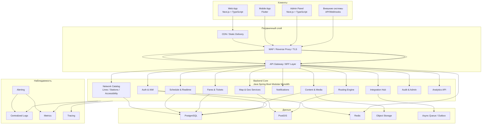
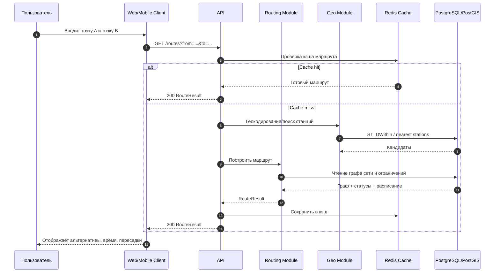
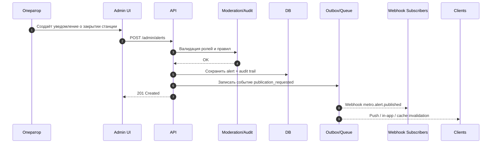
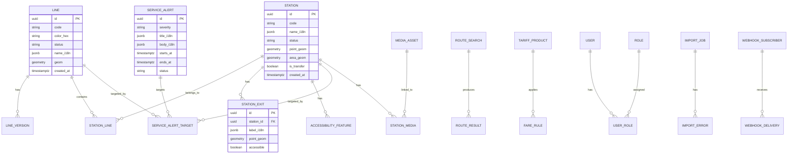
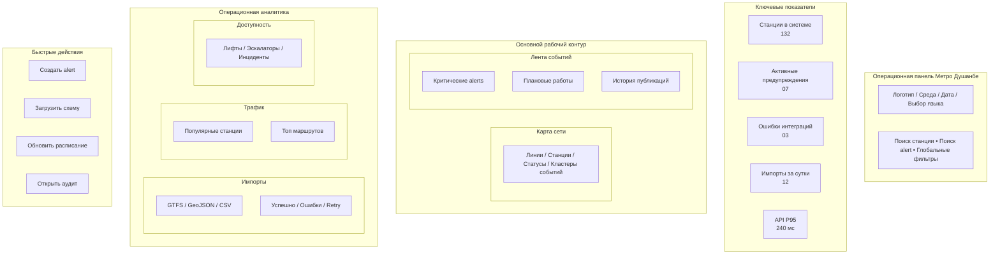

# Техническое задание на создание национальной цифровой платформы Метро Душанбе

## Executive summary

Настоящее ТЗ описывает создание городской и одновременно общедоступной цифровой платформы **«Метро Душанбе»** для жителей, гостей города, органов управления, операторов транспорта и интегрирующих государственных и коммерческих систем. Платформа должна включать веб-приложение, мобильные приложения, административную панель, публичный и служебный API, модуль интеграций и аналитический контур. Базовый стек принят заказчиком и закрепляется в настоящем ТЗ: **Next.js + TypeScript** для web, **Flutter** для mobile, **Java Spring Boot** для backend, **PostgreSQL + PostGIS** для данных и географии, **MapLibre** для картографии, **Redis** для кэша и событийных short-lived данных, **Docker** как основной способ упаковки и развёртывания на старте, с возможностью перехода к Kubernetes на следующих фазах. Архитектурный стиль старта — **модульный монолит** с явными bounded contexts и возможностью последующей декомпозиции в сервисы без переделки публичных контрактов. citeturn9search0turn9search1turn9search2turn9search3turn10search12turn10search10turn10search3

С учётом публично подтверждённого статуса проекта метро в Душанбе, цифровую платформу целесообразно строить поэтапно. Между Министерством транспорта Республики Таджикистан и Корейской национальной железной дорогой меморандум по теме строительства метро был подписан в марте 2022 года. В 2024 году корейской стороной был выполнен этап подготовки к ТЭО для участка от южных ворот столицы до района Государственного цирка, а в июле 2026 года Министерство транспорта сообщило о завершении очередного этапа подготовки к ТЭО для направления от проспекта Саади Ширази до Восточных ворот и о положительной оценке возможности строительства подземного метро. Одновременно в 2026 году стороны начали отдельный проект по развитию интеллектуального транспорта в Душанбе. Это означает, что платформа должна поддерживать **две реальности**: сначала — режим “строящийся объект и коммуникационная платформа”, затем — режим “эксплуатационная пассажирская и операционная платформа”. citeturn3view0turn3view2turn4view0turn3view5

Для определения минимально необходимого набора функций разумно опираться на официальные цифровые контуры существующих метрополитенов региона. У Московского метрополитена официальное приложение уже объединяет маршрутное планирование, карту города, новости о закрытиях и ремонтах, прибытие поездов и загрузку вагонов, а также платёжные и кабинетные функции. Алматинский метрополитен на официальном портале публикует схему метро, онлайн-расписание, оплату, мобильное приложение и отдельную версию для слабовидящих; в новостном блоке у него отдельно выведены QR-оплата и модернизация турникетов. Официальный сайт Ташкентского метрополитена позиционируется как портал с интерактивной картой, тарифами, способами оплаты, новостями, тендерами, обращениями и сервисами. Для Душанбе это задаёт реалистичный ориентир по функциям первой и второй очереди. citeturn15view0turn15view1turn15view2turn16search0

Настоящее ТЗ специально предусматривает, что точные перечни станций, окончательные геометрии линий, коммерческая тарифная сетка и операционные регламенты могут быть **не указаны** на момент утверждения документа. Поэтому в модель платформы включается обязательная поддержка импорта и версионирования транспортных данных в форматах **GeoJSON**, **GTFS Schedule**, **GTFS Realtime** и, по мере появления тарифных сценариев, **GTFS Fares v2**. Для каждого сущностного объекта должны сохраняться стабильные идентификаторы, что прямо соответствует лучшим практикам GTFS. citeturn14search0turn18search0turn18search1turn18search2turn18search7turn18search8

Ниже приводится полное ТЗ в формате, пригодном как для государственного закупочного досье, так и для проектирования, разработки, тестирования, внедрения и последующей эксплуатации.

## Оглавление

- Введение, цели, KPI и границы проекта
- Бизнес-требования, роли и функциональные модули
- Архитектура, API и модель данных
- UX/UI, дашборд и требования к доступности
- Безопасность, инфраструктура, качество и эксплуатация
- Внедрение, миграция, ресурсы, риски и приложения

## Введение, цели, KPI и границы проекта

### Введение и предмет ТЗ

Платформа **«Метро Душанбе»** — это единая цифровая система городского масштаба, предназначенная для публикации интерактивной карты метро, маршрутов, станций, расписаний, сервисных уведомлений, тарифов, цифровых билетов, а также для поддержки администрирования, аналитики и межведомственных интеграций. На ранних стадиях строительства метро платформа должна работать как официальный цифровой канал проекта, включающий карту проектируемой сети, паспорт объекта, дорожную карту, новостной и уведомительный контур, сбор обратной связи, а также инструменты для органов города и подготовительных служб. На стадии ввода в эксплуатацию платформа должна стать промышленной пассажирской системой с высокой доступностью и низкой задержкой. Такая поэтапность логична, поскольку по состоянию на июль 2026 года публично подтверждены этапы подготовки к ТЭО и проектированию, а не завершённая эксплуатационная конфигурация метро. citeturn4view0turn3view2

### Контекст проекта и исходные предпосылки

Официально подтверждённые публичные вехи проекта метро Душанбе на сегодня таковы: в марте 2022 года подписан профильный меморандум с корейской стороной; в 2025 году реализовывались малые проекты по пред-ТЭО; в 2026 году были запущены проекты по поддержке рабочей группы и подготовке пред-ТЭО второй линии от Государственного цирка до Восточных ворот; 1 июля 2026 года Министерство транспорта подвело итоги этапа подготовки к ТЭО направления от проспекта Саади Ширази до Восточных ворот и сообщило о положительной оценке возможности строительства подземного метро; отдельно 10 июня 2026 года было объявлено о новом проекте по развитию интеллектуального транспорта в Душанбе. Из этого следует, что цифровая платформа должна изначально проектироваться не как изолированное “приложение карты”, а как часть будущей транспортной цифровой экосистемы города. citeturn3view0turn3view2turn4view0turn3view5

### Цели платформы

Основные цели платформы:

| Цель | Содержание |
|---|---|
| Публичная навигация | Дать жителям и гостям города достоверную и удобную интерактивную карту метро и мультимодальных пересадок |
| Единый источник данных | Сформировать единый реестр линий, станций, объектов инфраструктуры, сервисных событий и тарифов |
| Операционное управление | Дать операторам инструменты публикации, валидации и диспетчеризации данных |
| Межведомственное взаимодействие | Обеспечить машиночитаемые API и события для органов города, ITS, банков, платёжных систем и других транспортных сервисов |
| Масштабируемость | Заложить архитектуру, способную поддержать рост от режима “строится” до режима массовой ежедневной эксплуатации |
| Доступность | Сделать систему доступной на таджикском, русском и английском языках, включая пользователей с ОВЗ |

### KPI проекта

KPI настоящего ТЗ являются управленческими и техническими целевыми показателями. Они устанавливаются заказчиком как критерии готовности продукта, а не как исторические данные.

| Группа KPI | Показатель | Целевое значение |
|---|---|---|
| Доступность | Доступность публичного web/API в месяц | не ниже 99,9% для продуктивного контура |
| Производительность | P95 ответа API чтения | не более 300 мс |
| Карта | Первый meaningful render карты на 4G | не более 2,5 сек |
| Уведомления | Время публикации сервисного сообщения от оператора до клиента | не более 60 сек |
| Локализация | Покрытие интерфейса тремя языками | 100% критических пользовательских экранов |
| Доступность | Соответствие WCAG | уровень AA |
| Данные | Доля объектов сети со стабильными идентификаторами и геометрией | 100% обязательных сущностей |
| Аналитика | SLA по обновлению витрин дашбордов | near real-time для операционных экранов, до 15 мин для BI |
| Безопасность | Критические уязвимости в релизе | 0 на момент go-live |
| Поддержка | Среднее время реакции на P1 | не более 15 минут |

Требования по доступности и API следует опирать на открытые стандарты: WCAG 2.2 для интерфейсов, OpenAPI 3.1 для HTTP API, OAuth 2.0 и JWT для авторизации, GTFS/GTFS Realtime для транспортных данных и RFC 7946 GeoJSON для географического обмена. citeturn11search2turn11search6turn0search2turn17view1turn11search0turn11search1turn18search0turn18search1turn14search0

### Заинтересованные стороны

| Группа | Интерес | Роль в проекте |
|---|---|---|
| Заказчик | Управление проектом, бюджет, стратегические KPI | Владелец продукта и данных |
| Хукумат и профильные органы города | Интеграция с городской транспортной политикой | Управляющий и надзорный контур |
| Министерство транспорта | Инфраструктурная и нормативная увязка | Государственный стейкхолдер |
| Оператор метро | Эксплуатация, расписания, инциденты, контент | Основной операционный пользователь |
| Жители и гости города | Карта, маршруты, уведомления, билеты | Массовая аудитория |
| Банки и платёжные системы | Билеты, эквайринг, возвраты | Интеграционные партнёры |
| ITS/GPS/общественный транспорт | Данные маршрутов, пересадок, телеметрии | Поставщики внешних данных |
| Разработчик/интегратор | Реализация, поддержка, DevOps | Исполнитель |

### Объём проекта

В объём настоящего проекта входят:

| Включено в объём | Описание |
|---|---|
| Публичный веб-портал | Карта, линии, станции, маршруты, тарифы, новости, уведомления |
| Мобильные приложения | Android и iOS на Flutter |
| Административная панель | CMS, управление справочниками, публикациями, маршрутами, уведомлениями, тарифами, пользователями и ролями |
| Backend-платформа | REST API, auth, геосервисы, маршрутизация, кэш, аудит, webhooks |
| Интеграционный слой | Работа с внешними API, очередями, ретраями, синхронизацией справочников, импортом GTFS/GeoJSON |
| Аналитика | Операционные дашборды, KPI, журналы событий |
| Набор данных | Модель линий, станций, объектов доступа, тарифов, уведомлений, медиа и документов |
| DevOps и эксплуатация | CI/CD, Docker, мониторинг, бэкапы, DRP, логирование, секреты |

### Границы проекта

Вне первоначального обязательного объёма, но с резервом в архитектуре:

| Вне первой очереди | Комментарий |
|---|---|
| Полноценный MaaS для всех видов транспорта | Поддержать архитектурно, но не считать MVP |
| Биометрическая оплата | Только при отдельном нормативном основании |
| Собственный авторизационный сервер уровня государственного IdP | Возможно как будущая интеграция |
| Полноценная микросервисная декомпозиция | Не обязательна на старте |
| Собственная telematics platform для поездов | Возможна интеграция, не часть MVP |
| Полный digital twin инфраструктуры | Вне текущего объёма |

### Допущения и неизвестные

Точные списки станций, полные геометрии линий, коммерческие правила тарификации, интервалы движения, спецификации турникетов, валидаторов и конечные схемы пересадок на момент составления настоящего ТЗ **не указаны** в публично доступных подтверждённых материалах. Поэтому система **обязана** поддерживать:
- импорт и замену схем в GeoJSON;
- импорт маршрутов и расписаний в GTFS Schedule;
- публикацию сервисных событий и realtime-данных в GTFS Realtime;
- постепенное включение тарифного домена через GTFS Fares v2 или совместимый внутренний канонический формат. citeturn18search7turn18search1turn18search2turn14search0

## Бизнес-требования, роли и функциональные модули

### Пользовательские роли

| Роль | Описание | Каналы |
|---|---|---|
| Гражданин | Житель города, пользуется картой, маршрутами, уведомлениями, билетами | Web, mobile |
| Гость города | Турист/пассажир без регистрации | Web, mobile |
| Оператор контента | Публикует новости, сервисные уведомления, карточки станций | Admin |
| Диспетчер/оператор движения | Управляет событиями сети, изменениями маршрутов и расписаний | Admin, API |
| Администратор системы | Пользователи, роли, интеграции, справочники, аудит | Admin |
| Аналитик | Доступ к дашбордам и выгрузкам | Admin, BI |
| Интегрирующая система | Внешний сервис, потребляет или передаёт данные | API, webhooks |
| Контролёр/аудитор | Просмотр журналов, инцидентов, истории изменений | Admin |

### Бизнес-сценарии

#### Сценарии гражданина

Гражданин должен иметь возможность открыть карту метро, увидеть линии и станции, найти ближайшую станцию, построить маршрут между станциями или адресами, увидеть предполагаемое время в пути, пересадки, режим работы и статус линии, получить push- или in-app-уведомление о закрытии станции, узнать тарифы и, на следующих фазах, купить или пополнить билет. Такой набор функций соответствует уже существующим официальным практикам Москвы, Алматы и Ташкента, где цифровые каналы метро охватывают карту, маршруты, расписание, новости, оплату и сервисные сообщения. citeturn15view0turn15view1turn16search0

**Основные user stories:**

| ID | User story | Приоритет |
|---|---|---|
| U-CIT-01 | Как пассажир, я хочу видеть карту и все линии, чтобы понять сеть | Must |
| U-CIT-02 | Как пассажир, я хочу искать станцию по названию и адресу | Must |
| U-CIT-03 | Как пассажир, я хочу строить маршрут между двумя точками | Must |
| U-CIT-04 | Как пассажир, я хочу видеть сервисные ограничения и ремонты | Must |
| U-CIT-05 | Как пассажир, я хочу читать карточку станции с выходами и доступностью | Must |
| U-CIT-06 | Как пассажир, я хочу получать уведомления по избранным линиям/станциям | Should |
| U-CIT-07 | Как пассажир, я хочу видеть тарифные продукты | Should |
| U-CIT-08 | Как пассажир, я хочу покупать/пополнять билет в приложении | Later phase |
| U-CIT-09 | Как пассажир с ОВЗ, я хочу пользоваться адаптированным интерфейсом | Must |

#### Сценарии оператора

| ID | User story | Приоритет |
|---|---|---|
| U-OPS-01 | Как оператор, я хочу заводить и редактировать станции и линии | Must |
| U-OPS-02 | Как оператор, я хочу публиковать изменения в расписании | Must |
| U-OPS-03 | Как оператор, я хочу публиковать service alerts | Must |
| U-OPS-04 | Как оператор, я хочу видеть очередь ошибок интеграций и повторять доставку | Must |
| U-OPS-05 | Как оператор, я хочу управлять локализациями контента | Must |
| U-OPS-06 | Как оператор, я хочу импортировать GeoJSON/GTFS и валидировать загрузку | Must |

#### Сценарии администратора

| ID | User story | Приоритет |
|---|---|---|
| U-ADM-01 | Как администратор, я хочу управлять пользователями, ролями и политиками доступа | Must |
| U-ADM-02 | Как администратор, я хочу настраивать интеграции и ключи API | Must |
| U-ADM-03 | Как администратор, я хочу видеть аудит действий | Must |
| U-ADM-04 | Как администратор, я хочу управлять фичефлагами по фазам внедрения | Must |

#### Сценарии интегрирующих систем

| ID | User story | Приоритет |
|---|---|---|
| U-INT-01 | Как ITS, я хочу получать справочник сети и статусы объектов | Must |
| U-INT-02 | Как платёжная система, я хочу подтверждать покупки и возвраты | Later phase |
| U-INT-03 | Как городской портал, я хочу получать вебхуки о событиях сети | Should |
| U-INT-04 | Как GPS/dispatch-платформа, я хочу публиковать realtime телеметрию | Should |

### Функциональные требования по модулям

#### Модуль карты

MapLibre GL JS является подходящим движком для браузерной интерактивной карты, поскольку предназначен для рендеринга интерактивных карт из векторных тайлов в браузере, а стиль карты задаётся отдельным JSON-документом. Для платформы метро это важно, потому что даёт независимый контроль над слоями, символикой линий, состояниями станций, зонами ремонта, доступностью, а в будущем и над 3D/indoor-представлениями. В настоящем ТЗ принимается подход: **канонические геоданные хранятся в PostGIS, а публичная визуализация строится через MapLibre-совместимый стиль и геослои**. citeturn9search3turn14search1turn19search12

| Требование | Описание |
|---|---|
| MAP-01 | Карта должна поддерживать отображение линий, станций, пересадочных узлов, выходов, объектов доступности |
| MAP-02 | Карта должна иметь режимы: проектируемая сеть, действующая сеть, комбинированный режим |
| MAP-03 | Карта должна поддерживать фильтрацию по линиям, типам объектов, статусам |
| MAP-04 | Карта должна поддерживать deep link на станцию, линию, маршрут |
| MAP-05 | Карта должна работать на web и mobile в одном стиле данных |
| MAP-06 | Карта должна поддерживать версионирование схем |
| MAP-07 | Должна быть реализована возможность отключения тяжёлых слоёв на слабых устройствах |
| MAP-08 | Геоданные должны импортироваться минимум из GeoJSON, а при необходимости и из Shapefile через конвейер импорта |

#### Модуль линий и станций

| Требование | Описание |
|---|---|
| NET-01 | В системе хранится карточка линии с кодом, названием, цветом, статусом, графиком, геометрией |
| NET-02 | В системе хранится карточка станции с многоязычными названиями |
| NET-03 | Для станции хранятся координаты, тип станции, статус, список выходов, доступность, фото, документы |
| NET-04 | Для станции хранятся связи с линиями и узлами пересадки |
| NET-05 | Поддерживается статус “проектируется / строится / тестируется / действует / временно закрыта / выведена из эксплуатации” |
| NET-06 | Каждая станция и линия имеют стабильный внешний идентификатор |

Стабильные идентификаторы и поставка данных по стабильному URL являются не просто удобством, а прямой рекомендацией GTFS best practices для транспортных данных; это особенно важно, если платформа должна обслуживать не только собственные интерфейсы, но и внешние потребляющие системы. citeturn18search0turn18search8

#### Модуль маршрутизации

| Требование | Описание |
|---|---|
| RTE-01 | Система должна строить маршрут станция-станция |
| RTE-02 | Система должна строить маршрут адрес-станция и адрес-адрес через геокодирование и сетевую модель |
| RTE-03 | Алгоритм должен учитывать длительность поездки, пересадки, закрытия, частичные ограничения |
| RTE-04 | Пользователь должен видеть альтернативные маршруты |
| RTE-05 | Пользователь должен видеть ориентировочное время в пути и число пересадок |
| RTE-06 | Для будущей эксплуатации должна быть предусмотрена поддержка realtime-коррекции маршрута |

#### Модуль расписания и realtime

GTFS Schedule задаёт базовый формат публикации расписаний, остановок, маршрутов и календарей, а GTFS Realtime — канал оперативных данных о нарушениях движения, позициях подвижного состава и прогнозных временах прибытия. Поэтому в настоящем ТЗ фиксируется, что внутренний канонический формат должен уметь транслироваться в GTFS static и GTFS Realtime без потери семантики для обязательных полей. citeturn18search7turn18search1turn18search16turn18search5

| Требование | Описание |
|---|---|
| SCH-01 | Поддержка базовых графиков движения по дням недели и периодам |
| SCH-02 | Поддержка исключений календаря |
| SCH-03 | Поддержка прогнозных прибытий и отправлений |
| SCH-04 | Поддержка service alerts по станциям, линиям, участкам, диапазонам времени |
| SCH-05 | Поддержка ручной публикации и API-публикации realtime-событий |
| SCH-06 | Поддержка истории изменений расписания |

#### Модуль уведомлений

| Требование | Описание |
|---|---|
| NTF-01 | Каналы: in-app, push, email, SMS опционально |
| NTF-02 | Таргетинг: вся сеть, линия, станция, сегмент, роль |
| NTF-03 | Типы: информация, предупреждение, авария, плановые работы, промо |
| NTF-04 | Поддержка многоязычных сообщений |
| NTF-05 | Поддержка шаблонов и отложенной публикации |
| NTF-06 | Поддержка подтверждения доставки и повторной отправки |

#### Модуль билетов и тарифов

Функции билетов могут вводиться поэтапно. На ранних стадиях допускается только публикация тарифов и правил проезда. На стадии коммерческой эксплуатации должен подключаться платёжный контур с транзакциями, возвратами, фискальными и учётными требованиями. GTFS Fares v2 уже предусматривает модель для fare products, rider categories, fare media и transfer logic, поэтому использовать эту спецификацию как внешний обменный формат целесообразно уже на стадии проектирования. citeturn18search2turn14search2turn14search10

| Требование | Описание |
|---|---|
| TKT-01 | Публикация тарифов и правил проезда |
| TKT-02 | Поддержка тарифных продуктов: разовый билет, проездной, льготный билет |
| TKT-03 | Поддержка платёжных статусов и возвратов |
| TKT-04 | Поддержка QR/штрихкода или токенизированного билета |
| TKT-05 | Поддержка интеграции с банковским эквайрингом |
| TKT-06 | Поддержка чёрных списков и антифрода |

#### Модуль интеграций

| Требование | Описание |
|---|---|
| INT-01 | REST API для синхронных интеграций |
| INT-02 | Webhooks для уведомления подписчиков о событиях |
| INT-03 | Очереди/асинхронный outbox для надёжной доставки |
| INT-04 | Импорт GeoJSON/GTFS/CSV |
| INT-05 | Retry, DLQ, идемпотентность, трассировка |
| INT-06 | Поддержка версионирования API и контрактов |

OpenAPI 3.1 формально поддерживает не только `paths`, но и `webhooks`, что делает его удобным базовым контрактом для документирования как синхронных, так и событийных интерфейсов платформы. citeturn17view1

#### Модуль аналитики

| Требование | Описание |
|---|---|
| BI-01 | Операционный дашборд по статусам сети, импортам, уведомлениям, API |
| BI-02 | Дашборд использования приложений и веба |
| BI-03 | Дашборд маршрутов и поисковых запросов |
| BI-04 | Дашборд качества данных |
| BI-05 | Дашборд инцидентов и SLA |

#### Модуль администрирования

| Требование | Описание |
|---|---|
| ADM-01 | Управление пользователями и ролями |
| ADM-02 | Справочники линий, станций, статусов, языков, медиа |
| ADM-03 | CMS для контента |
| ADM-04 | Импорт/экспорт данных |
| ADM-05 | Аудит действий |
| ADM-06 | Настройка API-клиентов, webhooks, секретов, лимитов |
| ADM-07 | Фичефлаги и stage-based rollout |

### Нефункциональные требования

#### Производительность и масштабируемость

| Параметр | Требование |
|---|---|
| Одновременные активные пользователи | проектировать минимум на 100 000 concurrent sessions на публичном контуре с горизонтальным scale-out |
| Запросы чтения | масштабирование через stateless web/API-узлы и Redis-кэш |
| Импорты | фоновые задания с очередями и job orchestration |
| Карта | геослои грузятся по тайлам/сегментам, а не полным дампом |
| Данные | индексация по Geo и тексту поиска |
| Рост | без пересмотра модели поддержать расширение до мультимодального транспорта |

#### Доступность и SLA

| Контур | SLA |
|---|---|
| Публичный web | 99,9% |
| Публичный API чтения | 99,9% |
| Admin | 99,5% |
| Реaltime каналы | 99,5% |
| Критические аварийные уведомления | RTO 30 мин, RPO 15 мин |

#### Локализация

Интерфейсы платформы должны быть доступны минимум на **таджикском, русском и английском** языках. Модель данных должна изначально предусматривать многоязычные поля для названий линий, станций, уведомлений, статей, подсказок и статусов. GTFS Realtime service alerts также допускают многозначные переводы текста в сообщениях, что полезно для интеграций и экспортов. citeturn14search11

#### Доступность для людей с ОВЗ

Требования UI должны соответствовать **WCAG 2.2 AA**. Практика официального портала метро Алматы с отдельной версией для слабовидящих показывает, что это не факультативная функция, а базовый стандарт пассажирской цифровой среды. citeturn11search2turn11search6turn15view1

| Область | Требование |
|---|---|
| Контраст | соответствие WCAG AA |
| Клавиатурная навигация | полная навигация без мыши |
| Экранные дикторы | корректные labels/roles/aria |
| Карта | альтернативный list mode и station mode |
| Текст | масштабирование минимум до 200% без потери функций |
| Motion | режим уменьшенной анимации |
| Цвет | нельзя полагаться только на цвет как носитель смысла |

## Архитектура, API и модель данных

### Архитектурные принципы

Выбранная архитектура — **модульный монолит на Java Spring Boot**. Этот подход соответствует стартовому состоянию проекта: он позволяет быстрее дойти до продуктивной поставки, удерживать целостную транзакционную модель, централизованно реализовать безопасность и аудит, а также избежать организационного и инфра-оверхода ранних микросервисов. При этом внутренние модули должны быть изолированы по пакетам, контрактам, БД-схемам и доменным сервисам так, чтобы позднее их можно было вынести в самостоятельные сервисы без ломки внешнего API. Spring Boot и Spring Security напрямую поддерживают построение HTTP API и защиту endpoint-ов через OAuth2 resource server с JWT. citeturn9search2turn19search1turn19search13

### Целевая компонентная схема



### Логическая модульная декомпозиция

| Модуль | Boundaries | Возможность вынесения в сервис в будущем |
|---|---|---|
| auth | пользователи, клиенты, токены, сессии, RBAC/ABAC | высокая |
| network-catalog | линии, станции, выходы, справочники | высокая |
| map-geo | геометрии, карты, слои, гео-запросы | высокая |
| routing | граф сети, алгоритмы маршрутизации | высокая |
| schedule-realtime | графики, события, статусы | высокая |
| fares-tickets | тарифы, продукты, транзакции | высокая |
| content | новости, страницы, медиа | средняя |
| notification | шаблоны, рассылки, push hooks | высокая |
| integration | webhooks, connectors, import/export, retry | высокая |
| admin-audit | аудит, настройки, фичефлаги | средняя |

### Технологический выбор по слоям

#### Frontend web и admin

Next.js имеет встроенную поддержку TypeScript и ориентирован на быстрые, интерактивные web-приложения, что делает его пригодным как для публичного портала, так и для админ-панели. TypeScript даёт статическую типизацию поверх JavaScript, снижая риск ошибок на уровне model/view/form/API contracts. citeturn9search0turn9search8turn9search16

#### Mobile

Flutter выбирается как единая база для Android и iOS. Официальная документация Flutter подчёркивает наличие богатого набора widgets и платформенно-адаптируемых UI-компонентов, что позволяет поддерживать единую дизайн-систему и быстро выводить синхронные функции на обе мобильные платформы. citeturn9search1turn9search5turn9search21

#### Backend

Spring Boot обеспечивает зрелую экосистему для web/API, security, validation, observability и интеграций. Spring Security на стороне resource server умеет защищать endpoints через OAuth2 Bearer Tokens, включая JWT. Это снижает риск нестандартной реализации безопасности и позволяет интегрироваться с внешними IdP. citeturn9search2turn19search1turn19search13

#### База данных и геоданные

PostGIS расширяет PostgreSQL пространственными типами, индексами и функциями, а spatial indexes на базе GiST являются базовым инструментом для производительной работы с геометриями. Для метро это критично: ближайшие станции, пересадки, сегменты линий, полигоны ремонта, геофильтры и рендер-усечения должны работать на индексируемой геомодели, а не на произвольном JSON-хранилище. citeturn10search12turn19search4turn19search3turn19search15turn19search12

#### Кэш и short-lived state

Redis подходит как для классического кэширования, так и для короткоживущих ключей, rate limiting, распределённых блокировок и event-like структур на streams/pub-sub. Это полезно для кэша маршрутов, рейтинга популярных станций, сессионных состояний и буфера realtime-событий. citeturn10search10turn10search2

#### DevOps

Docker остаётся достаточной стартовой основой: он унифицирует упаковку приложений и зависимостей, а Docker Compose позволяет описывать и запускать multi-container окружение одной декларативной конфигурацией. Документация Docker также отдельно описывает производственное использование Compose на одном сервере или удалённом Docker host, что соответствует стартовой модели развёртывания модульного монолита. Kubernetes допускается как следующая фаза, когда появится необходимость в multi-node autoscaling, service mesh и более сложной оркестрации. citeturn10search3turn19search6turn19search2

### Диаграмма последовательности для построения маршрута



### Диаграмма последовательности для публикации service alert



### API спецификация и стиль контрактов

Публичные и служебные API описываются в **OpenAPI 3.1**. Аутентификация реализуется по OAuth 2.0; формат access token по умолчанию — JWT; для server-to-server интеграций допускаются OAuth2 client credentials и mTLS в зависимости от критичности интеграции. Webhooks описываются в том же OpenAPI-документе. Geo-форматы — RFC 7946 GeoJSON. Транспортные выгрузки — GTFS static / GTFS Realtime. citeturn17view1turn11search0turn11search1turn14search0turn18search0turn18search1

#### Базовые правила API

| Правило | Требование |
|---|---|
| Версионирование | `/api/v1/...` |
| Формат | `application/json`, GeoJSON для геосервисов |
| Идемпотентность | обязательна для POST операций интеграций через `Idempotency-Key` |
| Pagination | cursor-based для больших списков |
| Ошибки | единый error envelope |
| Локализация | `Accept-Language` + explicit `lang` |
| Security | OAuth2/JWT для защищённых API |
| Webhooks | подпись payload + retry policy + replay protection |
| Observability | correlation-id/request-id обязательны |

#### Пример OpenAPI фрагмента

```yaml
openapi: 3.1.0
info:
  title: Metro Dushanbe API
  version: 1.0.0
  summary: Публичный и служебный API платформы Метро Душанбе
servers:
  - url: https://api.metro.dushanbe.tj
security:
  - oauth2: [metro.read]
paths:
  /api/v1/lines:
    get:
      summary: Список линий
      tags: [network]
      parameters:
        - in: query
          name: status
          schema:
            type: string
            enum: [planned, under_construction, testing, active, suspended]
      responses:
        "200":
          description: OK
  /api/v1/stations/{stationId}:
    get:
      summary: Карточка станции
      tags: [network]
      parameters:
        - in: path
          name: stationId
          required: true
          schema:
            type: string
      responses:
        "200":
          description: OK
  /api/v1/routes:
    get:
      summary: Построение маршрута
      tags: [routing]
      parameters:
        - in: query
          name: from
          schema: { type: string }
        - in: query
          name: to
          schema: { type: string }
        - in: query
          name: mode
          schema:
            type: string
            enum: [metro_only, multimodal]
      responses:
        "200":
          description: Route result
components:
  securitySchemes:
    oauth2:
      type: oauth2
      flows:
        authorizationCode:
          authorizationUrl: https://auth.metro.dushanbe.tj/oauth2/authorize
          tokenUrl: https://auth.metro.dushanbe.tj/oauth2/token
          scopes:
            metro.read: read public transport data
            metro.write: manage transport data
webhooks:
  metro.alert.published:
    post:
      requestBody:
        required: true
        content:
          application/json:
            schema:
              $ref: '#/components/schemas/ServiceAlertEvent'
      responses:
        "200":
          description: accepted
```

#### Канонический формат ошибок

```json
{
  "timestamp": "2026-07-04T12:15:00Z",
  "requestId": "3f4c2d1a-3d5d-4b0f-9d45-0d5f4b63fabc",
  "error": {
    "code": "station.not_found",
    "message": "Станция не найдена",
    "details": {
      "stationId": "station-9999"
    }
  }
}
```

### Webhooks

| Событие | Когда публикуется | Подписчики |
|---|---|---|
| `metro.alert.published` | опубликовано сервисное предупреждение | городской портал, табло, partners |
| `metro.schedule.updated` | обновлено расписание | интеграторы, BI |
| `metro.station.status.changed` | изменилась доступность станции | ITS, info-panels |
| `metro.ticket.payment.succeeded` | успешная покупка | платёжный и билетный контур |
| `metro.import.completed` | завершён импорт данных | admin tooling |

### Модель данных

#### ER-диаграмма



#### Основные сущности

| Сущность | Назначение |
|---|---|
| line | линия метро |
| station | станция |
| station_exit | выход станции |
| transfer_hub | пересадочный узел |
| accessibility_feature | лифт, эскалатор, пандус, тактильные указатели и т.д. |
| service_alert | уведомление о событии |
| schedule_version | версия расписания |
| trip / journey | поездка/рейс |
| arrival_prediction | прогноз прибытия |
| tariff_product | тарифный продукт |
| ticket | билет |
| payment_transaction | платёжная операция |
| import_job | импорт данных |
| webhook_subscriber | подписчик событий |
| audit_event | аудит |

#### Пример DDL

```sql
CREATE EXTENSION IF NOT EXISTS postgis;

CREATE TABLE metro_line (
    id UUID PRIMARY KEY,
    code VARCHAR(32) NOT NULL UNIQUE,
    color_hex VARCHAR(7) NOT NULL,
    status VARCHAR(32) NOT NULL,
    name_i18n JSONB NOT NULL,
    sort_order INT NOT NULL DEFAULT 0,
    geom geometry(MultiLineString, 4326),
    created_at TIMESTAMPTZ NOT NULL DEFAULT now(),
    updated_at TIMESTAMPTZ NOT NULL DEFAULT now()
);

CREATE TABLE metro_station (
    id UUID PRIMARY KEY,
    code VARCHAR(64) NOT NULL UNIQUE,
    status VARCHAR(32) NOT NULL,
    name_i18n JSONB NOT NULL,
    description_i18n JSONB,
    point_geom geometry(Point, 4326) NOT NULL,
    area_geom geometry(Polygon, 4326),
    is_transfer BOOLEAN NOT NULL DEFAULT false,
    attrs JSONB NOT NULL DEFAULT '{}'::jsonb,
    created_at TIMESTAMPTZ NOT NULL DEFAULT now(),
    updated_at TIMESTAMPTZ NOT NULL DEFAULT now()
);

CREATE TABLE metro_station_line (
    station_id UUID NOT NULL REFERENCES metro_station(id) ON DELETE CASCADE,
    line_id UUID NOT NULL REFERENCES metro_line(id) ON DELETE CASCADE,
    position_index INT NOT NULL,
    PRIMARY KEY (station_id, line_id)
);

CREATE INDEX ix_metro_line_geom ON metro_line USING GIST (geom);
CREATE INDEX ix_metro_station_point_geom ON metro_station USING GIST (point_geom);
CREATE INDEX ix_metro_station_name_i18n_gin ON metro_station USING GIN (name_i18n);
```

Использование `geometry/geography` и GiST-индексов соответствует базовым практикам PostGIS для пространственных запросов и масштабируемой геоаналитики. citeturn19search4turn19search3turn19search8

### Справочники и master data

| Справочник | Примеры значений |
|---|---|
| status_line | planned, under_construction, testing, active, suspended |
| status_station | planned, under_construction, active, temporarily_closed |
| accessibility_type | elevator, escalator, ramp, tactile, audio_assist |
| alert_severity | info, warning, critical |
| language | tg, ru, en |
| fare_media | qr, card, mobile_token, paper |
| rider_category | adult, child, student, senior, privileged |

### Импорт данных и форматы

GeoJSON по RFC 7946 принимается как основной обменный формат геометрий и feature-коллекций, что совместимо с картографическим стеком и удобно для внешних подрядчиков, проектировщиков и импортных конвейеров. GTFS Schedule используется как стандарт для публикации stops, routes, trips, calendars и связанных транспортных данных; GTFS Realtime — для service alerts, trip updates и vehicle positions; Fares v2 — для формализации тарифов при запуске билетов. citeturn14search0turn18search7turn18search1turn18search2

| Формат | Назначение |
|---|---|
| GeoJSON | линии, станции, выходы, зоны |
| GTFS Schedule | справочник сети и расписания |
| GTFS Realtime | оперативные изменения |
| CSV/XLSX | массовые административные загрузки |
| JSON | API/import service contracts |
| Media assets | SVG/PNG/WebP/JPEG/MP4/PDF по отдельным правилам |

## UX/UI, дашборд и требования к доступности

### UX-принципы

Поскольку платформа должна использоваться всем населением и органами города, UX должен быть не “дизайнерским showcase”, а системой с низким порогом входа. Основные принципы:
1. карта — первый экран, но не единственный;
2. любой сценарий с карты должен иметь альтернативу в списке;
3. на каждом экране должен быть явный ответ на вопрос пользователя: “где я?”, “куда ехать?”, “что закрыто?”, “сколько стоит?”, “как оплатить?”, “что делает город сейчас?”;
4. административный интерфейс должен быть похож на operational console, а не на generic CMS;
5. i18n и accessibility не могут добавляться постфактум.

### Информационная архитектура

| Web / Mobile гражданина | Admin / Operator |
|---|---|
| Главная | Операционная сводка |
| Карта | Линии |
| Станции | Станции |
| Маршруты | Расписания |
| Уведомления | Service alerts |
| Тарифы и билеты | Импорты данных |
| Новости | Контент |
| Помощь / FAQ | Пользователи и роли |
| Настройки языка и доступности | Интеграции / Webhooks / Аудит |

### Визуальный дашборд

Ниже — **макет операционного дашборда** для админ-панели. Это не финальный пиксель-perfect дизайн, а визуальная структурная схема, фиксирующая состав экрана и иерархию блоков.



### Состав экранов MVP

| Экран | Web | Mobile | Admin |
|---|---|---|---|
| Главная карта | Да | Да | Да |
| Карточка станции | Да | Да | Да |
| Маршрут | Да | Да | Нет |
| Уведомления | Да | Да | Да |
| Новости | Да | Да | Да |
| Тарифы | Да | Да | Да |
| Справочники | Нет | Нет | Да |
| Импорт GTFS/GeoJSON | Нет | Нет | Да |
| Аудит и журналы | Нет | Нет | Да |

### Цвета и дизайн-система

Предлагаемая базовая палитра должна быть официальной, технологичной и хорошо читаемой в тёмной и светлой темах.

| Назначение | Цвет |
|---|---|
| Primary | `#0057B8` |
| Accent | `#00A3A3` |
| Success | `#0F9D58` |
| Warning | `#F9AB00` |
| Danger | `#D93025` |
| Surface light | `#F7F9FC` |
| Surface dark | `#101418` |
| Text primary | `#1F2937` |
| Text inverse | `#F9FAFB` |

### Компоненты дизайн-системы

| Компонент | Требование |
|---|---|
| App Shell | единая навигация на web/admin/mobile |
| Map Container | адаптивная высота, skeleton loading |
| Station Card | название, выходы, доступность, фото, статусы |
| Alert Banner | severity, иконка, сроки, CTA |
| Route Card | время, пересадки, статус, альтернативы |
| KPI Card | заголовок, значение, дельта, sparkline optional |
| Table | сортировка, фильтрация, сохранённые представления |
| Form controls | одинаковое поведение validation/error/help |
| Timeline | ремонты, публикации, аудит |
| Drawer/Bottom Sheet | mobile interaction pattern |

### Адаптивность

| Breakpoint | Назначение |
|---|---|
| ≤ 480 px | компактный mobile |
| 481–768 px | large mobile / small tablet |
| 769–1200 px | tablet / small desktop |
| ≥ 1201 px | desktop / operations console |

### i18n

| Требование | Описание |
|---|---|
| I18N-01 | все текстовые строки вынесены в словари |
| I18N-02 | поддержка RTL не обязательна на первой фазе, но layout должен её не ломать |
| I18N-03 | станции, линии и контент хранятся в i18n JSON-полях |
| I18N-04 | язык пользователя определяется по профилю, затем по `Accept-Language`, затем по умолчанию |

### Accessibility

WCAG 2.2 определяет принципы perceivable, operable, understandable и robust, а значит интерфейс метро должен проектироваться так, чтобы навигация, выбор маршрутов и чтение критических уведомлений были доступны пользователям с визуальными, моторными, слуховыми и когнитивными ограничениями. citeturn11search2turn11search6

| Требование | Реализация |
|---|---|
| A11Y-01 | контраст AA во всех основных сценариях |
| A11Y-02 | skip links и landmark roles |
| A11Y-03 | читаемые статусы и ошибки форм |
| A11Y-04 | полностью клавиатурная навигация |
| A11Y-05 | описания для иконок и не-текстовых элементов |
| A11Y-06 | текстовые альтернативы карте и схемам |
| A11Y-07 | поддержка screen reader announcement для сервисных alerts |
| A11Y-08 | режим “версия для слабовидящих” как отдельный UX-профиль |

## Безопасность, инфраструктура, качество и эксплуатация

### Безопасность и соответствие

Для идентификации и авторизации клиентских и интеграционных обращений принимаются **OAuth 2.0** и **JWT**. JWT — компактный формат передачи утверждений, пригодный для подписанных или шифруемых токенов; OAuth 2.0 — формализованный каркас делегированной авторизации. Для web и mobile пользователей допускается модель через внешний IdP/SSO, для machine-to-machine — client credentials, а для особо чувствительных интеграций — mTLS поверх стандартного OAuth. citeturn11search0turn11search1turn19search1

#### Базовая security-модель

| Направление | Требование |
|---|---|
| IAM | централизованное управление пользователями, ролями, клиентами, scopes |
| SSO | поддержка внешнего Identity Provider |
| MFA | обязательно для admin и operator ролей |
| RBAC | базовая модель ролей для всех экранов и API |
| ABAC | атрибутные ограничения для действий и контуров данных |
| Secrets | хранение вне кода, ротация |
| Encryption in transit | TLS 1.2+ |
| Encryption at rest | шифрование дисков, резервных копий и секретных полей |
| Audit | полная трасса изменения критичных сущностей |
| Anti-abuse | rate limiting, anomaly detection, brute-force protection |

#### Матрица ролей

| Действие | Citizen | Operator | Admin | Auditor | Integrator |
|---|---|---|---|---|---|
| Смотреть карту | Да | Да | Да | Да | Через API |
| Смотреть тарифы | Да | Да | Да | Да | Через API |
| Публиковать alert | Нет | Да | Да | Нет | Нет |
| Загружать GeoJSON/GTFS | Нет | Да | Да | Нет | По API/ETL |
| Управлять ролями | Нет | Нет | Да | Нет | Нет |
| Читать аудит | Нет | Частично | Да | Да | Нет |
| Настраивать webhooks | Нет | Нет | Да | Нет | Нет |

#### Логирование и SIEM

| Объект | Логируется |
|---|---|
| Вход и неуспешный вход | Да |
| Выдача токена | Да |
| Изменение ролей и прав | Да |
| Публикация alert | Да |
| Импорт данных | Да |
| Ошибки интеграций | Да |
| Изменение тарифов и расписаний | Да |
| Операции с билетами | Да |

#### Соответствие законодательству

Для платформы требуется соблюдение законодательства Республики Таджикистан о защите персональных данных и об электронном документе и электронной подписи. Закон о защите персональных данных определяет правовые и организационные основы сбора, обработки и защиты персональных данных, а закон об электронном документе и электронной подписи фиксирует условия использования электронной подписи в электронных документах и юридическую эквивалентность защищённой электронной подписи собственноручной при соблюдении установленных условий. В ТЗ следует закладывать data minimization, purpose limitation, consent management там, где он нужен, а также возможность юридически значимых электронных действий в служебном контуре. Если отдельные интеграции затрагивают гражданские реестры, банковские транзакции или биометрические данные, нужные правовые режимы должны быть дополнительно проверены на этапе юридического дизайна. citeturn12search0turn12search1turn13search2turn13search17turn13search9

#### Безопасная разработка

OWASP ASVS рекомендуется принять как базовый чек-лист при проектировании, разработке и security testing web- и mobile-компонентов платформы. citeturn11search3

### Интеграции

В официальных сообщениях Министерства транспорта уже фигурируют не только проекты по метро, но и проект по развитию интеллектуального транспорта в Душанбе, поэтому интеграционный слой платформы должен изначально проектироваться как транспортный, а не только “метрошный”. citeturn3view5

#### Целевой перечень интеграций

| Система | Назначение | Тип обмена |
|---|---|---|
| Минтранс | нормативные и справочные данные, официальные новости | API / manual sync |
| Органы города Душанбе | координация событий, дорожные работы, городские уведомления | API / webhooks |
| МВД / УГАИ | дорожные ограничения, безопасность, перекрытия | API / secured exchange |
| Банки | оплата билетов, возвраты, эквайринг | API |
| Платёжные системы | QR, токены, подтверждения платёжных статусов | API |
| ITS | статусы транспортной инфраструктуры | API / event stream |
| GPS / телеметрия | realtime-позиции для мультимодального слоя | API / queue |
| Общественный транспорт | пересадки metro-bus-trolley-bus | GTFS / API |
| Городской портал / суперприложение | публикация карты и событий | API / widget / webhooks |
| Контакт-центр | статусы сервисных инцидентов | API |

#### Интеграционные паттерны

| Паттерн | Когда применять |
|---|---|
| REST sync | чтение справочников, карточек, поиска |
| Webhooks | уведомление о событиях |
| Batch import | массовая загрузка геоданных и расписаний |
| Queue / outbox | гарантированная доставка и decoupling |
| Retry with backoff | временно недоступный внешний сервис |
| Dead Letter Queue | ручная обработка необработанных событий |
| Idempotent consumer | повторная доставка без дублей |

#### Очереди, retry и устойчивость

| Требование | Описание |
|---|---|
| RET-01 | каждая интеграционная операция имеет correlation-id |
| RET-02 | повторы — экспоненциальный backoff |
| RET-03 | неуспешные сообщения уходят в DLQ |
| RET-04 | все webhook delivery attempts логируются |
| RET-05 | входящие payload проходят проверку схемы и подписи |

### Инфраструктура и DevOps

#### Среды

| Среда | Назначение |
|---|---|
| local/dev | разработка |
| test | автотесты и ручная проверка |
| stage/preprod | интеграционное и UAT-окружение |
| prod | продуктив |
| dr | резервный контур |

#### CI/CD

| Шаг | Содержание |
|---|---|
| Source control | trunk-based / protected branches |
| Build | web/mobile/backend images |
| Static analysis | lint, type-check, SAST |
| Tests | unit + integration + contract |
| Security scan | container scan, dependency scan |
| Deploy | blue/green или rolling, с feature flags |
| Verification | smoke + health + synthetic checks |
| Rollback | автоматизированный откат по сигналам качества |

#### Мониторинг и метрики

| Тип | Примеры |
|---|---|
| Инфраструктурные | CPU, RAM, disk, network |
| Приложение | latency, throughput, errors, saturation |
| Бизнесовые | route searches, alerts published, station views |
| Интеграции | webhook success rate, import failure rate |
| Безопасность | failed logins, token anomalies, admin changes |

#### Бэкапы и DRP

| Объект | Политика |
|---|---|
| PostgreSQL | ежедневные full + частые incremental/WAL shipping |
| Object storage | versioning + replicated copies |
| Redis | RDB/AOF по выбранной роли |
| Config/Secrets | резервирование в защищённом хранилище |
| DR-тесты | минимум ежеквартально |

### Тестирование и критерии приёмки

#### Виды тестирования

| Вид | Обязательность |
|---|---|
| Unit | Да |
| Integration | Да |
| Contract | Да |
| E2E | Да |
| Performance / Load | Да |
| Security / Pen-test | Да |
| Accessibility testing | Да |
| UAT | Да |
| Data migration rehearsal | Да |
| Disaster recovery rehearsal | Да |

#### Критерии приёмки

| Категория | Критерий |
|---|---|
| Функциональность | все Must-требования пройдены в UAT |
| Производительность | P95 и SLA соответствуют утверждённым целям |
| Безопасность | нет открытых критических и высоких уязвимостей без согласованного исключения |
| UX | основные пользовательские сценарии проходят без блокирующих замечаний |
| i18n | таджикский, русский, английский покрывают все критические экраны |
| Accessibility | ключевые сценарии соответствуют WCAG 2.2 AA |
| Интеграции | все обязательные интеграции успешно отработали тестовые сценарии |
| Эксплуатация | мониторинг, бэкап, rollback и DRP проверены |
| Документация | предоставлен полный пакет тех. и пользовательской документации |

#### Нагрузочное тестирование

| Сценарий | Цель |
|---|---|
| Пиковый просмотр карты | часы массовой публикации новостей/инцидентов |
| Пик маршрутного поиска | утро/вечер, резкое изменение режима линии |
| Массовая доставка alerts | аварийный сценарий |
| Импорт большой схемы | обновление версии сети |
| Платёжный пик | при запуске билетов |

### Документация и поддержка

| Документ | Обязателен |
|---|---|
| Архитектурное описание | Да |
| API handbook / OpenAPI bundle | Да |
| ER-модель и словарь данных | Да |
| Runbook эксплуатации | Да |
| Incident playbooks | Да |
| Руководство администратора | Да |
| Руководство оператора | Да |
| Руководство контент-менеджера | Да |
| Руководство интегратора | Да |
| User help / FAQ | Да |

## Внедрение, миграция, ресурсы, риски и приложения

### План миграции и импорт данных

Поскольку проект метро ещё находится в подготовительной инфраструктурной стадии, миграция здесь означает не только перенос из старых ИС, но и **поэтапное накопление доверенного мастер-набора данных**. Вначале источниками будут проектные GeoJSON/таблицы/чертежи, затем — GTFS static, а потом — realtime и тарифные потоки. Это делает обязательным наличие Data Intake Pipeline с валидацией схем, нормализацией идентификаторов и версионированием импортов. Практики GTFS прямо рекомендуют стабильный URL публикации и устойчивые идентификаторы, что важно для последующих интеграций и клиентских кэшей. citeturn18search0turn18search8

#### Этапы миграции данных

| Этап | Содержание |
|---|---|
| Data discovery | инвентаризация всех источников геометрий, справочников, медиа, проектных файлов |
| Canonical model | утверждение внутренней схемы line/station/alerts/fares/users/integrations |
| Cleanse | очистка дублей, нормализация кодов и языков |
| Import adapters | коннекторы для GeoJSON, GTFS, CSV/XLSX |
| Validation | схема, семантика, геометрия, referential integrity |
| Rehearsal | пробные импорты на stage |
| Cutover | загрузка в prod и freeze старых таблиц/файлов |
| Post-cutover QA | контроль целостности и пользовательские проверки |

#### Правила импорта

| Правило | Требование |
|---|---|
| IMP-01 | каждый импорт имеет source system, source file, hash, version, operator |
| IMP-02 | импорт идемпотентен |
| IMP-03 | ошибки сохраняются построчно и посущностно |
| IMP-04 | обязательно preview перед применением |
| IMP-05 | должно быть сравнение diff между текущей и новой версией |

### План внедрения и фазы до 2033 года

Ниже приводится **проектный план платформы**, а не официально утверждённый государством календарь строительства метро. Его логика привязана к публично подтверждённым этапам подготовки ТЭО и проектирования 2026–2028 годов и к необходимости иметь полнофункциональный цифровой контур к будущему запуску первой эксплуатационной очереди. citeturn4view0turn3view2

#### Рекомендуемая фазировка

| Фаза | Период | Результат |
|---|---|---|
| Подготовка | 2026–2027 | ТЗ, data model, архитектура, дизайн-система, прототипы, PoC карты |
| MVP публичной платформы | 2027–2028 | сайт и mobile с картой проектируемой сети, карточками линий/станций, новостями, alerts, admin |
| Фаза операционной готовности | 2028–2029 | импорты GTFS/GeoJSON, интеграции с ITS/городом, аудит, дашборды, SLA-эксплуатация |
| Фаза расширения транспорта | 2029–2030 | мультимодальные пересадки, richer routing, API для внешних сервисов |
| Фаза билетного контура | 2030–2031 | тарифный движок, билеты, QR/эквайринг, пользовательский кабинет |
| Фаза предзапуска эксплуатации | 2031–2032 | rehearsal эксплуатационных сценариев, realtime, observability, нагрузочные тесты |
| Фаза готовности к вводу линии | 2032–2033 | production hardening, DR, масштабирование, массовый public rollout |

### Ресурсы и оценка трудозатрат

Это ориентировочная продуктово-техническая оценка.

| Роль | Средняя загрузка |
|---|---|
| Product owner / госзаказчик | 0,5–1 FTE |
| Project manager | 1 FTE |
| Solution architect | 1 FTE |
| Backend engineers | 3–6 FTE |
| Frontend engineers | 2–4 FTE |
| Flutter engineers | 2–4 FTE |
| QA engineers | 2–4 FTE |
| DevOps/SRE | 1–2 FTE |
| UX/UI designers | 1–2 FTE |
| Data/BI engineer | 1–2 FTE |
| Security engineer | 0,5–1 FTE |
| Business/System analyst | 1–2 FTE |

#### Грубая оценка по блокам

| Блок | Оценка |
|---|---|
| Discovery, BRD, UX, architecture | 8–14 недель |
| MVP public + admin | 5–8 месяцев |
| Integrations + analytics + observability | 3–5 месяцев |
| Tickets/fare engine | 4–7 месяцев |
| Hardening, UAT, rollout | 2–4 месяца |

### Оценка рисков и меры смягчения

| Риск | Вероятность | Влияние | Меры |
|---|---|---|---|
| Неустойчивость исходных проектных данных | Высокая | Высокое | версионирование, import preview, data stewardship |
| Изменение трасс и станций | Высокая | Среднее | schema versioning, feature flags, soft-delete исторических сущностей |
| Задержка интеграций внешних систем | Высокая | Высокое | loose coupling, mock adapters, staged onboarding |
| Недостаточная нормативная готовность билетного контура | Средняя | Высокое | вынести ticketing в отдельную фазу |
| Высокая публичная нагрузка в кризисный момент | Средняя | Высокое | CDN, кэширование, degraded mode |
| Ошибки локализации | Средняя | Среднее | централизованный i18n workflow |
| Инциденты безопасности | Средняя | Высокое | MFA, ASVS, pen-test, SIEM, least privilege |
| Vendor lock-in на картографии | Низкая | Среднее | MapLibre + открытые форматы и стили |
| Разрастание монолита | Средняя | Среднее | модульные границы, события домена, контрактная дисциплина |

### Приложения

#### Шаблон JSON линии

```json
{
  "id": "4cc0a8f3-8f8b-47d4-a3f2-59aaf0a57544",
  "code": "LINE-01",
  "name": {
    "tg": "Хати 1",
    "ru": "Линия 1",
    "en": "Line 1"
  },
  "status": "under_construction",
  "colorHex": "#0057B8",
  "geometry": {
    "type": "MultiLineString",
    "coordinates": []
  }
}
```

#### Шаблон JSON станции

```json
{
  "id": "f8ab2a3b-5897-4e81-9d47-6f4326f0a219",
  "code": "ST-STATE-CIRCUS",
  "name": {
    "tg": "Сирк",
    "ru": "Государственный цирк",
    "en": "State Circus"
  },
  "status": "planned",
  "location": {
    "type": "Point",
    "coordinates": [69.0, 38.5]
  },
  "accessibility": [
    "elevator",
    "tactile"
  ],
  "lines": ["LINE-01", "LINE-02"]
}
```

#### Шаблон JSON service alert

```json
{
  "id": "7ba4fc2a-52fd-4ec7-9bc2-0343d9b7e84c",
  "severity": "critical",
  "title": {
    "tg": "Истгоҳ муваққатан баста аст",
    "ru": "Станция временно закрыта",
    "en": "Station temporarily closed"
  },
  "body": {
    "tg": "Вуруд барои корҳои техникӣ баста шудааст",
    "ru": "Вход закрыт в связи с техническими работами",
    "en": "Entrance closed due to technical works"
  },
  "startsAt": "2026-08-01T06:00:00Z",
  "endsAt": "2026-08-01T18:00:00Z",
  "targets": [
    {
      "type": "station",
      "id": "f8ab2a3b-5897-4e81-9d47-6f4326f0a219"
    }
  ]
}
```

#### Матрица требований к данным

| Домен | Канонический формат | Внешний формат | Версионирование |
|---|---|---|---|
| Сеть | Postgres/PostGIS | GeoJSON / GTFS | Да |
| Расписание | relational + JSON | GTFS Schedule | Да |
| Realtime | event model | GTFS Realtime / webhooks | Да |
| Тарифы | relational | GTFS Fares v2 / partner API | Да |
| Контент | relational + object storage | JSON / media | Да |
| Аудит | append-only | JSON export | Да |

#### Минимальный список сущностей

| Категория | Сущности |
|---|---|
| Сеть | line, line_version, station, station_exit, transfer_hub |
| Гео | geometry_layer, map_style, zone, poi |
| Движение | timetable, service_day, trip, arrival_prediction |
| События | service_alert, incident, maintenance_window |
| Билеты | tariff_product, fare_rule, ticket, payment_transaction |
| Пользователи | user, role, permission, api_client |
| Интеграции | import_job, webhook_subscriber, delivery_attempt |
| Медиа | media_asset, document_asset |
| Контроль | audit_event, admin_action, feature_flag |

#### Рекомендуемые стандарты и нормативная база проекта

- OpenAPI 3.1 для контрактов HTTP API и webhooks. citeturn17view1
- OAuth 2.0 и JWT для аутентификации/авторизации и токенов. citeturn11search0turn11search1
- RFC 7946 GeoJSON для обмена геоданными. citeturn14search0
- GTFS Schedule, GTFS Realtime и GTFS Fares v2 для транспортных данных. citeturn18search7turn18search1turn18search2
- WCAG 2.2 AA для доступности интерфейсов. citeturn11search2turn11search6
- OWASP ASVS как базис verification checklist по безопасности. citeturn11search3
- PostGIS для хранения, индексации и запросов геоданных. citeturn19search12turn19search3

#### Итоговый архитектурный выбор

Для настоящего ТЗ окончательно фиксируется следующий технический профиль решения:

| Слой | Выбор |
|---|---|
| Public Web | Next.js + TypeScript |
| Admin Web | Next.js + TypeScript |
| Mobile | Flutter |
| Backend | Java Spring Boot |
| Архитектурный стиль | модульный монолит |
| База данных | PostgreSQL + PostGIS |
| Кэш | Redis |
| Карта | MapLibre |
| Деплой | Docker |
| Масштабирование будущих фаз | Kubernetes optional |
| API | REST + OpenAPI 3.1 + Webhooks |
| Auth | OAuth2 + JWT |
| Интерфейсы | таджикский / русский / английский |

В таком виде платформа “Метро Душанбе” остаётся технически реалистичной для быстрого старта, соответствует открытым стандартам транспорта и API, учитывает текущую стадию проекта метро в Душанбе и в то же время создаёт фундамент для городской цифровой платформы, пригодной как для массового использования гражданами, так и для рабочих контуров органов города и транспортных операторов. citeturn4view0turn3view5turn15view0turn15view1turn16search0turn17view1turn18search0turn14search0